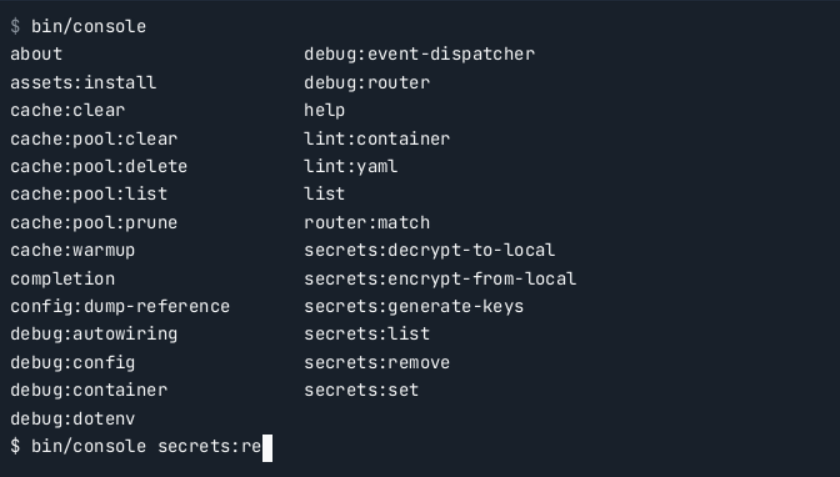

# 🧰 Konsol Komutları

Symfony framework, **bin/console** betiği aracılığıyla birçok komut sağlar (örneğin, çok bilinen **bin/console cache:clear** komutu). Bu komutlar **Console** bileşeni ile oluşturulmuştur. Kendi komutlarınızı oluşturmak için de bu bileşeni kullanabilirsiniz.

---

### ▶️ Komutların Çalıştırılması

Her Symfony uygulaması, geniş bir komut kümesiyle birlikte gelir. Uygulamada mevcut tüm komutları görüntülemek için **list** komutunu kullanabilirsiniz:

```bash
php bin/console list
```

Çıktı örneği:

```
Available commands:
  about             Display information about the current project
  completion        Dump the shell completion script
  help              Display help for a command
  list              List commands
 assets
  assets:install    Install bundle's web assets under a public directory
 cache
  cache:clear       Clear the cache
...
```

**list** varsayılan komuttur, bu nedenle sadece şu komutu çalıştırmak da aynıdır:

```bash
php bin/console
```

İhtiyacınız olan komutu bulduğunuzda, o komutun belgelerini görmek için **--help** seçeneğini kullanabilirsiniz:

```bash
php bin/console assets:install --help
```

 **--help** , Console bileşeninin tüm komutlar için geçerli olan yerleşik genel seçeneklerinden biridir. Bunlar hakkında daha fazla bilgi edinmek için ilgili bölümü inceleyebilirsiniz.

---

### ⚙️ APP_ENV ve APP_DEBUG

Konsol komutları, varsayılan olarak `.env` dosyasındaki **APP_ENV** değişkeninde tanımlı ortamda (genellikle `dev`) çalışır. Ayrıca, hata ayıklama modunu açıp kapatmak için **APP_DEBUG** değerini okur (varsayılan olarak `1`, yani açık durumdadır).

Komutu farklı bir ortamda veya hata ayıklama modunda çalıştırmak için **APP_ENV** ve **APP_DEBUG** değerlerini düzenleyebilirsiniz. Bunları komut çalıştırırken de tanımlayabilirsiniz, örneğin:

```bash
APP_ENV=prod php bin/console cache:clear
```

---

### 💡 Konsol Tamamlama (Console Completion)

Eğer  **Bash** , **Zsh** veya **Fish** kabuğunu kullanıyorsanız, Symfony’nin tamamlayıcı betiğini yükleyerek terminalde komut yazarken otomatik tamamlama özelliğini etkinleştirebilirsiniz.

Tüm komutlar, isim ve seçenek tamamlama desteğine sahiptir; bazıları değer tamamlama özelliğini de destekler.





### ⚡ Konsol Tamamlama Kurulumu

İlk olarak, tamamlama betiğini bir kez yüklemeniz gerekir.

Kabuğunuza uygun kurulum talimatlarını görmek için şu komutu çalıştırın:

```bash
bin/console completion --help
```

**Bash** kullanıyorsanız, işletim sisteminiz için “bash-completion” adlı paketi kurup yapılandırdığınızdan emin olun.

Kurulumu tamamladıktan ve terminalinizi yeniden başlattıktan sonra, (varsayılan olarak **Tab** tuşuna basarak) otomatik tamamlama özelliğini kullanabilirsiniz.

Birçok PHP aracı (örneğin  **Composer** , **PHPStan** ve  **Behat** ) **Symfony Console** bileşeni ile oluşturulmuştur.

Eğer bu araçlar 5.4 veya üzeri bir sürüm kullanıyorsa, onların da tamamlama betiğini yükleyip konsol tamamlama özelliğini etkinleştirebilirsiniz:

```bash
php vendor/bin/phpstan completion --help
composer completion --help
```

**Symfony CLI** aracını kullanıyorsanız, otomatik tamamlama özelliğini etkinleştirmek için kendi yönergelerini izleyin.

---

### 🧱 Komut Oluşturma

Komutlar, sınıflar içinde tanımlanır ve **#[AsCommand]** niteliği (attribute) kullanılarak otomatik olarak kaydedilir.

Örneğin, bir kullanıcı oluşturma komutu tanımlayabilirsiniz:

```php
// src/Command/CreateUserCommand.php
namespace App\Command;

use Symfony\Component\Console\Attribute\AsCommand;
use Symfony\Component\Console\Command\Command;

// komutun adı, "php bin/console" sonrasında kullanıcıların yazacağı addır
#[AsCommand(name: 'app:create-user')]
class CreateUserCommand
{
    public function __invoke(): int
    {
        // ... burada kullanıcı oluşturma kodunu yazın

        // bu metod, komutun "çıkış durum kodunu" (exit status code) belirten
        // bir tamsayı döndürmelidir. Daha okunabilir olması için sabitleri kullanabilirsiniz.

        // komut sorunsuz çalıştıysa:
        return Command::SUCCESS;

        // çalışırken hata oluştuysa:
        // return Command::FAILURE;

        // yanlış komut kullanımı (örneğin eksik argüman veya hatalı seçenek) varsa:
        // return Command::INVALID;
    }
}
```

Eğer PHP **attributes** kullanamıyorsanız, komutu bir servis olarak kaydedip `console.command` etiketiyle etiketleyebilirsiniz.

Varsayılan **services.yaml** yapılandırmasını kullanıyorsanız, bu işlem zaten **autoconfiguration** sayesinde otomatik yapılır.

Ayrıca, **#[AsCommand]** niteliğiyle komutunuza açıklama ve detaylı yardım metni ekleyebilirsiniz:

```php
#[AsCommand(
    name: 'app:create-user',
    description: 'Creates a new user.', // "php bin/console list" çıktısında gösterilen açıklama
    help: 'This command allows you to create a user...', // "--help" seçeneğiyle görüntülenen yardım metni
)]
class CreateUserCommand
{
    public function __invoke(): int
    {
        // ...
    }
}
```

Daha gelişmiş özelliklerden (örneğin **initialize()** ve **interact()** gibi yaşam döngüsü metotları) yararlanmak için **Command** sınıfını genişletebilirsiniz:

```php
use Symfony\Component\Console\Attribute\AsCommand;
use Symfony\Component\Console\Command\Command;
use Symfony\Component\Console\Input\InputInterface;
use Symfony\Component\Console\Output\OutputInterface;

#[AsCommand(name: 'app:create-user')]
class CreateUserCommand extends Command
{
    public function initialize(InputInterface $input, OutputInterface $output): void
    {
        // ...
    }

    public function interact(InputInterface $input, OutputInterface $output): void
    {
        // ...
    }

    public function __invoke(): int
    {
        // ...
    }
}
```

---

### 🚀 Komutu Çalıştırma

Komutu yapılandırıp kaydettikten sonra, terminalde şu şekilde çalıştırabilirsiniz:

```bash
php bin/console app:create-user
```

Henüz herhangi bir mantık yazmadığınız için bu komut bir şey yapmayacaktır.

Kendi işlemlerinizi `__invoke()` metodu içine ekleyebilirsiniz.

---

### 🖥️ Konsol Çıktısı

`__invoke()` metodu, konsola mesaj yazdırmak için **OutputInterface** nesnesine erişebilir:

```php
public function __invoke(OutputInterface $output): int
{
    // konsola birden fazla satır yazar ("\n" karakteri otomatik eklenir)
    $output->writeln([
        'User Creator',
        '============',
        '',
    ]);

    // someMethod() bir iterator döndürebilir ve yield ile mesaj üretebilir
    $output->writeln($this->someMethod());

    // tek satırlık mesaj (satır sonuna "\n" eklenir)
    $output->writeln('Whoa!');

    // satır sonu olmadan mesaj yazma
    $output->write('You are about to ');
    $output->write('create a user.');

    return Command::SUCCESS;
}
```

Komutu şimdi çalıştırın:

```bash
php bin/console app:create-user
```

Çıktı:

```
User Creator
============

Whoa!
You are about to create a user.
```


### 🧩 Çıktı Bölümleri (Output Sections)

Normal konsol çıktısı, **“output sections”** adı verilen bağımsız bölgelere ayrılabilir.

Bu bölümler, çıktı bilgisini temizleyip yeniden yazmanız gerektiğinde kullanılır.

Bölümler, `ConsoleOutput::section()` metodu ile oluşturulur ve bu metod bir **ConsoleSectionOutput** örneği döndürür:

```php
use Symfony\Component\Console\Output\ConsoleOutputInterface;

#[AsCommand(name: 'app:my-command')]
class MyCommand
{
    public function __invoke(OutputInterface $output): int
    {
        if (!$output instanceof ConsoleOutputInterface) {
            throw new \LogicException('This command accepts only an instance of "ConsoleOutputInterface".');
        }

        $section1 = $output->section();
        $section2 = $output->section();

        $section1->writeln('Hello');
        $section2->writeln('World!');
        sleep(1);
        // Çıktı: "Hello\nWorld!\n"

        // overwrite(): mevcut bölüm içeriğini tamamen verilen içerikle değiştirir
        $section1->overwrite('Goodbye');
        sleep(1);
        // Çıktı: "Goodbye\nWorld!\n"

        // clear(): bölümün tüm içeriğini siler
        $section2->clear();
        sleep(1);
        // Çıktı: "Goodbye\n"

        // belirli sayıda satırı da silebilirsiniz (örnek: son iki satırı)
        $section1->clear(2);
        sleep(1);
        // Çıktı tamamen boş!

        // setMaxHeight(): yeni satırların eskilerini değiştirmesini sağlar
        $section1->setMaxHeight(2);
        $section1->writeln('Line1');
        $section1->writeln('Line2');
        $section1->writeln('Line3');

        return Command::SUCCESS;
    }
}
```

Bir bölüme bilgi yazdırırken, yeni satır otomatik olarak eklenir.

Bu bölümler, **bağımsız ilerleme çubukları** veya **daha önce çizilmiş tablolara yeni satır ekleme** gibi gelişmiş çıktı yönetimlerini mümkün kılar.

💡 **Not:** Terminaller yalnızca görünür içeriği değiştirebilir, bu nedenle çıktı bölümlerini yazarken konsol yüksekliğini dikkate almanız gerekir.

---

### 🧭 Konsol Girdisi (Console Input)

Komutlara bilgi aktarmak için **girdi seçenekleri (options)** veya **argümanlar (arguments)** kullanılır:

```php
use Symfony\Component\Console\Attribute\Argument;

public function __invoke(#[Argument('The username of the user.')] string $username, OutputInterface $output): int
{
    $output->writeln([
        'User Creator',
        '============',
        '',
    ]);

    $output->writeln('Username: '.$username);

    return Command::SUCCESS;
}
```

Artık komutu şu şekilde çalıştırabilirsiniz:

```bash
php bin/console app:create-user Wouter
```

Çıktı:

```
User Creator
============

Username: Wouter
```

Daha fazla bilgi için **Console Input (Arguments & Options)** bölümüne bakın.

---

### 🧩 Servis Container’dan Servis Erişimi

Gerçek bir kullanıcı oluşturmak için komutun bazı servislere erişmesi gerekir.

Komutunuz zaten bir servis olarak kayıtlı olduğundan, **bağımlılık enjeksiyonu (dependency injection)** kullanabilirsiniz.

Örneğin, `App\Service\UserManager` servisini kullanan bir komut:

```php
use App\Service\UserManager;
use Symfony\Component\Console\Attribute\Argument;
use Symfony\Component\Console\Attribute\AsCommand;

#[AsCommand(name: 'app:create-user')]
class CreateUserCommand
{
    public function __construct(
        private UserManager $userManager
    ) {
    }

    public function __invoke(#[Argument] string $username, OutputInterface $output): int
    {
        $this->userManager->create($username);

        $output->writeln('User successfully generated!');

        return Command::SUCCESS;
    }
}
```

---

### 🔄 Komut Yaşam Döngüsü (Command Lifecycle)

Bir komut çalıştırıldığında üç yaşam döngüsü metodu çağrılır:

1. **initialize()** *(isteğe bağlı)*
   * `interact()` ve `execute()` (veya `__invoke()`) metodlarından önce çalışır.
   * Komutta kullanılacak değişkenleri başlatmak için kullanılır.
2. **interact()** *(isteğe bağlı)*
   * `initialize()` sonrasında, `execute()` öncesinde çağrılır.
   * Eksik argüman veya seçenekleri kullanıcıdan etkileşimli olarak almak için kullanılır.
   * `--no-interaction` seçeneği kullanıldığında çağrılmaz.
3. **__invoke() / execute()** *(zorunlu)*
   * Komutun asıl işlevini içerir.
   * Çıkış durum kodunu döndüren bir **int** değeri döndürmelidir.

---

### 🧪 Komutların Test Edilmesi

Symfony, komut testlerini kolaylaştırmak için çeşitli araçlar sağlar.

En kullanışlısı **CommandTester** sınıfıdır; bu sınıf, gerçek bir konsol olmadan komutu test etmeyi kolaylaştırır:

```php
// tests/Command/CreateUserCommandTest.php
namespace App\Tests\Command;

use Symfony\Bundle\FrameworkBundle\Console\Application;
use Symfony\Bundle\FrameworkBundle\Test\KernelTestCase;
use Symfony\Component\Console\Tester\CommandTester;

class CreateUserCommandTest extends KernelTestCase
{
    public function testExecute(): void
    {
        self::bootKernel();
        $application = new Application(self::$kernel);

        $command = $application->find('app:create-user');
        $commandTester = new CommandTester($command);
        $commandTester->execute([
            'username' => 'Wouter',
        ]);

        $commandTester->assertCommandIsSuccessful();

        $output = $commandTester->getDisplay();
        $this->assertStringContainsString('Username: Wouter', $output);
    }
}
```

Tek komutlu bir uygulama kullanıyorsanız, sonucu almak için `setAutoExit(false)` çağırın.

Ayrıca tüm konsol uygulamasını test etmek için **ApplicationTester** sınıfını da kullanabilirsiniz.

> 🔔 **Notlar:**
>
> * `CommandTester` kullanırken konsol olayları tetiklenmez. Olayları test etmek istiyorsanız `ApplicationTester` kullanın.
> * `ApplicationTester` kullanırken otomatik çıkışı devre dışı bırakın:
>   ```php
>   $application = new Application();
>   $application->setAutoExit(false);
>   $tester = new ApplicationTester($application);
>   ```
> * `InputOption::VALUE_NONE` seçeneklerini test ederken değere `true` geçin:
>   ```php
>   $commandTester->execute(['--some-option' => true]);
>   ```

Bağımsız bir Console projesinde test yaparken, `Application` sınıfını kullanın ve normal `PHPUnit\Framework\TestCase` sınıfını genişletin.

---

### 🖥️ Terminal Bilgilerine Erişim

Komutlarınızı test ederken terminalin  **genişlik** , **yükseklik** veya **renk modu** gibi özelliklerini bilmek yararlı olabilir.

Bu bilgilere **Terminal** sınıfı ile erişebilirsiniz:

```php
use Symfony\Component\Console\Terminal;

$terminal = new Terminal();

// terminaldeki satır sayısını alır
$height = $terminal->getHeight();

// sütun sayısını alır
$width = $terminal->getWidth();

// renk modunu alır
$colorMode = $terminal->getColorMode();

// renk modunu değiştirir
$terminal->setColorMode(AnsiColorMode::Ansi24);
```


### 🪵 Komut Hatalarını Günlüğe Kaydetme (Logging Command Errors)

Bir komut çalıştırılırken bir **istisna (exception)** fırlatıldığında, Symfony bu durumu tüm komut bilgileriyle birlikte otomatik olarak **log** dosyasına kaydeder.

Ayrıca, Symfony `ConsoleEvents::TERMINATE` olayını dinleyen bir **event subscriber** kaydeder ve bir komut **0 dışında bir çıkış kodu** ile bittiğinde bir log mesajı oluşturur.

---

### 🧠 Olaylar ve Sinyal Yönetimi (Using Events and Handling Signals)

Bir komut çalışırken, birçok olay (event) tetiklenir.

Bu olaylardan biri, **sinyallere tepki vermenizi** sağlar.

Bu konuda daha fazla bilgi için ilgili bölüme göz atabilirsiniz.

---

### 🧩 Komutların Profillenmesi (Profiling Commands)

Symfony, sizin oluşturduğunuzlar da dahil olmak üzere herhangi bir komutun çalıştırılmasını **profillemenizi** sağlar.

1. Öncelikle, **debug modu** ve **profiler** etkinleştirilmiş olmalıdır.
2. Ardından komutu çalıştırırken `--profile` seçeneğini ekleyin:

```bash
php bin/console --profile app:my-command
```

Symfony artık komutun yürütülmesi hakkında veri toplayacak; bu veriler, **hataları ayıklamak** veya **performans sorunlarını incelemek** için oldukça yararlıdır.

Komut çalıştırma tamamlandığında, profil **web profiler arayüzü** üzerinden erişilebilir hale gelir.

#### 🔍 Ek Özellikler

* Komutu **ayrıntılı (verbose)** modda çalıştırırsanız (`-v` seçeneğiyle), Symfony çıktı üzerinde komut profilinin bulunduğu **tıklanabilir bir bağlantı** gösterir (terminal destekliyorsa).
* **Debug ayrıntı seviyesi** (`-vvv`) kullanıldığında, komutun **süre** ve **bellek kullanımı** da gösterilir.

> 💡 **Messenger bileşenindeki** `messenger:consume` komutunu profillerken:
>
> * `--no-reset` seçeneğini ekleyin, aksi takdirde profil oluşturulmaz.
> * Profilin daha okunabilir olması için `--limit` seçeneğini kullanarak birkaç mesajla sınırlandırabilirsiniz.

---

### 📘 Daha Fazlasını Öğrenin

* **How to Call Other Commands** – Başka komutları nasıl çağıracağınızı öğrenin
* **How to Color and Style the Console Output** – Konsol çıktısını renklendirme ve biçimlendirme
* **How to Call a Command from a Controller** – Bir Controller içinden komut çalıştırma
* **How to Define Commands as Services** – Komutları servis olarak tanımlama
* **How to Hide Console Commands** – Konsol komutlarını gizleme
* **Console Input (Arguments & Options)** – Argümanlar ve seçeneklerle girdi sağlama
* **How to Make Commands Lazily Loaded** – Komutları tembel yükleme (lazy loading)
* **Prevent Running the Same Console Command Multiple Times** – Aynı komutun birden fazla kez çalıştırılmasını engelleme
* **How to Style a Console Command** – Konsol komutlarını biçimlendirme
* **Verbosity Levels** – Ayrıntı (verbosity) seviyeleri

---

### 🧰 Yardımcılar (Helpers)

**Console** bileşeni, çeşitli küçük ama kullanışlı araçlar (helpers) içerir:

* 🗣️ **Question Helper:** Kullanıcıdan etkileşimli olarak bilgi almak için
* 🎨 **Formatter Helper:** Çıktı renklendirmesini ve biçimini özelleştirmek için
* 📊 **Progress Bar:** İşlemler için ilerleme çubuğu göstermek
* 🔄 **Progress Indicator:** İlerlemeyi simge ile göstermek
* 🧮 **Table Helper:** Verileri tablo şeklinde göstermek
* 🪲 **Debug Formatter Helper:** Harici program çalıştırırken hata ayıklama bilgilerini biçimlendirmek
* ⚙️ **Process Helper:** `DebugFormatterHelper` ile birlikte süreçleri (process) çalıştırmak
* ➡️ **Cursor Helper:** Terminal imlecini kontrol etmek
* 🌳 **Tree Helper:** Ağaç yapısındaki verileri görselleştirmek
