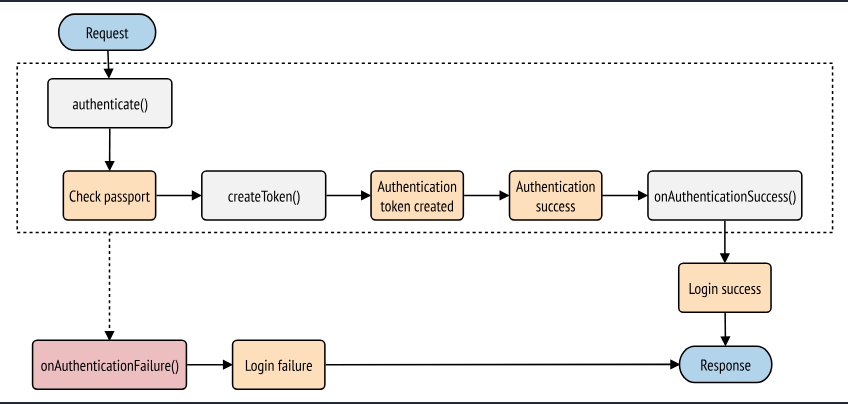

## 🔒 Güvenlik

Symfony, uygulamanızı güvence altına almak için birçok araç sağlar. Güvenli oturum çerezleri ve CSRF koruması gibi bazı HTTP ile ilgili güvenlik araçları varsayılan olarak sağlanır. Bu kılavuzda öğreneceğiniz SecurityBundle, uygulamanızı güvenceye almak için gerekli tüm kimlik doğrulama ve yetkilendirme özelliklerini sağlar.

Başlamak için SecurityBundle’ı yükleyin:

```
composer require symfony/security-bundle
```

Symfony Flex yüklüyse, sizin için bir `security.yaml` yapılandırma dosyası da oluşturur:

```yaml
# config/packages/security.yaml
security:
    # https://symfony.com/doc/current/security.html#registering-the-user-hashing-passwords
    password_hashers:
        Symfony\Component\Security\Core\User\PasswordAuthenticatedUserInterface: 'auto'
    # https://symfony.com/doc/current/security.html#where-do-users-come-from-user-providers
    providers:
        users_in_memory: { memory: null }
    firewalls:
        dev:
            pattern: ^/(_(profiler|wdt)|css|images|js)/
            security: false
        main:
            lazy: true
            provider: users_in_memory

            # farklı kimlik doğrulama yöntemlerini etkinleştir
            # https://symfony.com/doc/current/security.html#firewalls-authentication

            # https://symfony.com/doc/current/security/impersonating_user.html
            # switch_user: true

    # Sitenizin büyük bölümleri için erişimi kontrol etmenin kolay bir yolu
    # Not: Yalnızca *ilk* eşleşen access control kullanılacaktır
    access_control:
        # - { path: ^/admin, roles: ROLE_ADMIN }
        # - { path: ^/profile, roles: ROLE_USER }
```

Oldukça fazla yapılandırma var! Sonraki bölümlerde üç ana unsur tartışılacak:

* **Kullanıcı (providers)**

  Uygulamanızın güvenli bölümleri bir kullanıcı kavramına ihtiyaç duyar. Kullanıcı sağlayıcı, kullanıcıları bir depolamadan (ör. veritabanı) “kullanıcı tanımlayıcısına” (ör. e-posta adresi) göre yükler.
* **Güvenlik Duvarı ve Kimlik Doğrulama (firewalls)**

  Güvenlik duvarı, uygulamanızı güvenceye almanın merkezidir. Güvenlik duvarı içindeki her istekte, kimlik doğrulaması gerekip gerekmediği kontrol edilir. Ayrıca kullanıcıyı kimlik doğrulamasından geçirir (ör. bir giriş formu aracılığıyla).
* **Erişim Kontrolü (access_control)**

  Erişim kontrolü ve yetkilendirme denetçisi kullanılarak, belirli bir eylemi gerçekleştirmek veya belirli bir URL’yi ziyaret etmek için gerekli izinler kontrol edilir.

---

## 👤 Kullanıcı

Symfony’de izinler her zaman bir kullanıcı nesnesine bağlıdır. Uygulamanızın (bölümlerini) güvenceye almak istiyorsanız, bir kullanıcı sınıfı oluşturmanız gerekir. Bu sınıf `UserInterface` uygular. Genellikle bir Doctrine varlığıdır, ancak özel bir Security kullanıcı sınıfı da kullanabilirsiniz.

En kolay yol, **MakerBundle** içindeki `make:user` komutunu kullanmaktır:

```
php bin/console make:user
```

Komut, kullanıcı sınıfını ve deposunu oluşturur:

```php
// src/Entity/User.php
namespace App\Entity;

use App\Repository\UserRepository;
use Doctrine\ORM\Mapping as ORM;
use Symfony\Component\Security\Core\User\PasswordAuthenticatedUserInterface;
use Symfony\Component\Security\Core\User\UserInterface;

#[ORM\Entity(repositoryClass: UserRepository::class)]
class User implements UserInterface, PasswordAuthenticatedUserInterface
{
    #[ORM\Id]
    #[ORM\GeneratedValue]
    #[ORM\Column(type: 'integer')]
    private int $id;

    #[ORM\Column(type: 'string', length: 180, unique: true)]
    private ?string $email;

    #[ORM\Column(type: 'json')]
    private array $roles = [];

    #[ORM\Column(type: 'string')]
    private string $password;

    public function getId(): ?int
    {
        return $this->id;
    }

    public function getEmail(): ?string
    {
        return $this->email;
    }

    public function setEmail(string $email): self
    {
        $this->email = $email;
        return $this;
    }

    public function getUserIdentifier(): string
    {
        return (string) $this->email;
    }

    public function getRoles(): array
    {
        $roles = $this->roles;
        $roles[] = 'ROLE_USER';
        return array_unique($roles);
    }

    public function setRoles(array $roles): self
    {
        $this->roles = $roles;
        return $this;
    }

    public function getPassword(): string
    {
        return $this->password;
    }

    public function setPassword(string $password): self
    {
        $this->password = $password;
        return $this;
    }
}
```

MakerBundle v1.57.0 itibarıyla `--with-uuid` veya `--with-ulid` parametreleri ile `make:user` çalıştırabilirsiniz. Symfony’nin  **Uid Component** ’ini kullanarak `id` türü `Uuid` veya `Ulid` olan bir kullanıcı varlığı oluşturur.

Eğer kullanıcı bir Doctrine varlığıysa, tabloyu oluşturmayı unutmayın:

```
php bin/console make:migration
php bin/console doctrine:migrations:migrate
```

MakerBundle v1.56.0’dan itibaren `--formatted` parametresi, daha düzenli bir migration dosyası oluşturur.

---

## 🧩 Kullanıcıyı Yükleme: User Provider

`make:user` komutu ayrıca güvenlik yapılandırmanıza bir user provider ekler:

```php
// config/packages/security.php
use App\Entity\User;
use Symfony\Config\SecurityConfig;

return static function (SecurityConfig $security): void {
    $security->provider('app_user_provider')
        ->entity()
            ->class(User::class)
            ->property('email');
};
```

Bu provider, kullanıcıları bir “kullanıcı tanımlayıcısına” (ör. e-posta adresi) göre yükler. Yukarıdaki yapılandırma, Doctrine kullanarak `email` alanına göre User varlığını yükler.

Kullanıcı sağlayıcı şu durumlarda kullanılır:

* Giriş sırasında kullanıcıyı tanımlayıcıya göre yüklemek
* Oturumdan kullanıcıyı yeniden yüklemek (ör. veritabanını tekrar sorgulayarak verileri güncel tutmak)

Symfony’de yerleşik kullanıcı sağlayıcı türleri:

* **Entity User Provider:** Doctrine veritabanından yükler
* **LDAP User Provider:** LDAP sunucusundan yükler
* **Memory User Provider:** Yapılandırma dosyasından yükler
* **Chain User Provider:** Birden fazla sağlayıcıyı birleştirir

Ayrıca özel user provider’lar da oluşturabilirsiniz.

---

## 🔑 Kullanıcı Kaydı: Parola Hashleme

Birçok uygulama, kullanıcının parola ile giriş yapmasını ister.  **SecurityBundle** , parola hashleme ve doğrulama işlevselliği sağlar.

Önce kullanıcı sınıfınızın `PasswordAuthenticatedUserInterface` uyguladığından emin olun:

```php
use Symfony\Component\Security\Core\User\PasswordAuthenticatedUserInterface;

class User implements UserInterface, PasswordAuthenticatedUserInterface
{
    public function getPassword(): string
    {
        return $this->password;
    }
}
```

Sonra, hangi parola hashleyicisinin kullanılacağını yapılandırın:

```php
// config/packages/security.php
use App\Entity\User;
use Symfony\Component\Security\Core\User\PasswordAuthenticatedUserInterface;

return static function (SecurityConfig $security): void {
    $security->passwordHasher(PasswordAuthenticatedUserInterface::class)
        ->algorithm('auto');
};
```

Artık Symfony, parolaları nasıl hashleyeceğinizi biliyor. Parolayı veritabanına kaydetmeden önce `UserPasswordHasherInterface` servisini kullanın:

```php
// src/Controller/RegistrationController.php
namespace App\Controller;

use Symfony\Component\HttpFoundation\Response;
use Symfony\Component\PasswordHasher\Hasher\UserPasswordHasherInterface;

class RegistrationController extends AbstractController
{
    public function index(UserPasswordHasherInterface $passwordHasher): Response
    {
        $user = new User(...);
        $plaintextPassword = ...;

        $hashedPassword = $passwordHasher->hashPassword(
            $user,
            $plaintextPassword
        );
        $user->setPassword($hashedPassword);

        // ...
    }
}
```

Kullanıcı sınıfınız bir Doctrine varlığıysa ve parola hashliyorsanız, ilgili repository sınıfı `PasswordUpgraderInterface` uygulamalıdır.

---

## 📨 Kayıt Formu Oluşturma

`make:registration-form` komutu, kayıt denetleyicisini ayarlamanıza ve e-posta adresi doğrulaması gibi özellikler eklemenize yardımcı olur:

```
composer require symfonycasts/verify-email-bundle
php bin/console make:registration-form
```

Ayrıca manuel olarak parola hashlemek için şu komutu çalıştırabilirsiniz:

```
php bin/console security:hash-password
```

Tüm mevcut hashleyiciler ve parola geçişi hakkında daha fazla bilgi için **Password Hashing and Verification** bölümüne bakın.


## 🧱 Güvenlik Duvarı (Firewall)

`config/packages/security.yaml` dosyasındaki **firewalls** bölümü en önemli bölümdür.

Bir “firewall”, kimlik doğrulama sisteminizdir: firewall, uygulamanızın hangi bölümlerinin güvenli olacağını ve kullanıcıların nasıl kimlik doğrulayabileceğini (ör. giriş formu, API token, vb.) tanımlar.

```php
// config/packages/security.php
use Symfony\Config\SecurityConfig;

return static function (SecurityConfig $security): void {
    // ...

    // firewalls tanımlanma sırası çok önemlidir, çünkü
    // istek, pattern ile eşleşen ilk firewall tarafından işlenir
    $security->firewall('dev')
        ->pattern('^/(_(profiler|wdt)|css|images|js)/')
        ->security(false)
    ;

    // pattern belirtilmeyen bir firewall en son tanımlanmalıdır,
    // çünkü tüm isteklerle eşleşecektir
    $security->firewall('main')
        ->lazy(true)

        // farklı kimlik doğrulama yöntemlerini etkinleştir
        // https://symfony.com/doc/current/security.html#firewalls-authentication

        // https://symfony.com/doc/current/security/impersonating_user.html
        // ->switchUser(true)
    ;
};
```

Her istekte yalnızca **bir firewall** aktiftir: Symfony, **pattern** anahtarını kullanarak ilk eşleşmeyi bulur

(host veya diğer kriterlerle de eşleşme yapılabilir).

Burada, **main firewall** tüm gerçek URL’leri işler (pattern anahtarı olmaması tüm URL’lerle eşleştiği anlamına gelir).

`dev` firewall ise aslında sahte bir firewall’dır:

Amaç, Symfony’nin geliştirme araçlarını (ör. `/ _profiler`, `/ _wdt`) yanlışlıkla engellemenizi önlemektir.

---

## 🧩 Birden Fazla Route Eşleştirme

Birden fazla rotayı eşleştirirken uzun bir regex kullanmak yerine, her rota için daha basit regex’lerden oluşan bir dizi kullanabilirsiniz:

```php
// config/packages/security.php
use Symfony\Config\SecurityConfig;

return static function (SecurityConfig $security): void {
    // ...
    $security->firewall('dev')
        ->pattern([
            '^/_profiler/',
            '^/_wdt/',
            '^/css/',
            '^/images/',
            '^/js/',
        ])
        ->security(false)
    ;

    // ...
};
```

Bu özellik **XML yapılandırma formatı** tarafından desteklenmez.

---

Bir firewall birçok kimlik doğrulama moduna sahip olabilir;

başka bir deyişle, “Sen kimsin?” sorusuna farklı şekillerde yanıt alabilir.

Kullanıcılar genellikle web sitenizi ilk ziyaret ettiklerinde **bilinmeyen** (yani giriş yapmamış) durumdadır.

Şu anda ana sayfanızı ziyaret ederseniz, erişiminiz olur ve araç çubuğunda güvenlik duvarı arkasındaki bir sayfayı ziyaret ettiğinizi görebilirsiniz.


## 🌐 Güvenlik Duvarı Altındaki URL’ler

Bir firewall altındaki bir URL’yi ziyaret etmek, her zaman kimlik doğrulaması gerektirmez (örneğin, giriş formu erişilebilir olmalıdır veya uygulamanızın bazı bölümleri herkese açık olabilir).

Öte yandan, giriş yapmış bir kullanıcıdan haberdar olması gereken tüm sayfalar **aynı firewall altında** olmalıdır.

Yani, her sayfada “Şu kullanıcı olarak giriş yaptınız...” gibi bir mesaj göstermek istiyorsanız, bu sayfaların tamamı aynı firewall kapsamına alınmalıdır.

Firewall içinde yer alan URL’lere, denetleyicilere veya diğer kaynaklara erişimi nasıl kısıtlayabileceğinizi **access control** bölümünde öğreneceksiniz.

---

## ⚡ Lazy Anonymous Modu

Lazy anonymous modu, yetkilendirme gerekmediği sürece (ör. kullanıcı ayrıcalığına açıkça bakılmadıkça) oturumun başlatılmasını engeller.

Bu, isteklerin **önbelleğe alınabilir** kalması açısından önemlidir (bkz.  *HTTP Cache* ).

---

## 🧰 Profiler Kurulumu

Eğer araç çubuğunu (toolbar) göremiyorsanız, profiler’ı şu komutla yükleyin:

```
composer require --dev symfony/profiler-pack
```

---

## 🔍 Bir İstek İçin Firewall Yapılandırmasını Alma

Belirli bir isteğe karşılık gelen firewall yapılandırmasını almak isterseniz, **Security** servisini kullanabilirsiniz:

```php
// src/Service/ExampleService.php
use Symfony\Bundle\SecurityBundle\Security;
use Symfony\Component\HttpFoundation\RequestStack;

class ExampleService
{
    public function __construct(
        // getFirewallConfig() metodunu yapıcıda çağırmayın: kimlik doğrulama henüz tamamlanmamış olabilir.
        // Bunun yerine Security nesnesini saklayın.
        private Security $security,
        private RequestStack $requestStack,
    ) {
    }

    public function someMethod(): void
    {
        $request = $this->requestStack->getCurrentRequest();
        $firewallName = $this->security->getFirewallConfig($request)?->getName();

        // ...
    }
}
```

---

## 🔐 Kullanıcıların Kimlik Doğrulaması

Kimlik doğrulama sırasında sistem, sayfayı ziyaret eden kullanıcıya karşılık gelen bir kullanıcıyı bulmaya çalışır.

Bu, geleneksel olarak bir **giriş formu** veya **HTTP Basic** diyaloğu aracılığıyla yapılırdı.

Ancak  **SecurityBundle** , birçok başka kimlik doğrulayıcı (authenticator) ile birlikte gelir:

* Form Login
* JSON Login
* HTTP Basic
* Login Link
* X.509 Client Certificates
* Remote Users
* Custom Authenticators

Eğer uygulamanız kullanıcıları **Google, Facebook veya Twitter** gibi üçüncü taraf servislerle giriş yaptırıyorsa, **HWIOAuthBundle** veya **Oauth2-client** paketine göz atın.

---

## 🧾 Form Login

Çoğu web sitesi, kullanıcıların bir tanımlayıcı (ör. e-posta adresi veya kullanıcı adı) ve parola kullanarak kimlik doğruladığı bir giriş formuna sahiptir.

Bu işlevsellik, yerleşik **FormLoginAuthenticator** tarafından sağlanır.

Uygulamanıza bir giriş formu eklemek için gerekli her şeyi oluşturmak üzere şu komutu çalıştırabilirsiniz:

```
php bin/console make:security:form-login
```

Bu komut, gerekli denetleyiciyi ve Twig şablonunu oluşturur ve güvenlik yapılandırmasını günceller.

Değişiklikleri manuel yapmak isterseniz aşağıdaki adımları izleyin.

---

### 🧩 1. Giriş Denetleyicisini Oluşturma

```
php bin/console make:controller Login
```

Bu komut şunları oluşturur:

* `src/Controller/LoginController.php`
* `templates/login/index.html.twig`

```php
// src/Controller/LoginController.php
namespace App\Controller;

use Symfony\Bundle\FrameworkBundle\Controller\AbstractController;
use Symfony\Component\HttpFoundation\Response;
use Symfony\Component\Routing\Attribute\Route;

class LoginController extends AbstractController
{
    #[Route('/login', name: 'app_login')]
    public function index(): Response
    {
        return $this->render('login/index.html.twig', [
            'controller_name' => 'LoginController',
        ]);
    }
}
```

---

### ⚙️ 2. FormLoginAuthenticator’ı Etkinleştirme

```php
// config/packages/security.php
use Symfony\Config\SecurityConfig;

return static function (SecurityConfig $security): void {
    // ...

    $mainFirewall = $security->firewall('main');

    // "app_login" daha önce oluşturulan route adıdır
    $mainFirewall->formLogin()
        ->loginPath('app_login')
        ->checkPath('app_login');
};
```

`login_path` ve `check_path` hem URL hem de route adını destekler,

ancak zorunlu parametre içeren wildcard’lar (ör. `/login/{foo}`) desteklenmez.

Bu ayar etkinleştirildiğinde, kimliği doğrulanmamış kullanıcılar güvenli bir sayfaya erişmeye çalıştığında

otomatik olarak `login_path` adresine yönlendirilir.

(Bu davranış, **authentication entry points** kullanılarak özelleştirilebilir.)

---

### 🧠 3. Giriş Formunu Düzenleme

```php
use Symfony\Component\Security\Http\Authentication\AuthenticationUtils;

class LoginController extends AbstractController
{
    #[Route('/login', name: 'app_login')]
    public function index(AuthenticationUtils $authenticationUtils): Response
    {
        // varsa giriş hatasını al
        $error = $authenticationUtils->getLastAuthenticationError();

        // kullanıcının en son girdiği kullanıcı adını al
        $lastUsername = $authenticationUtils->getLastUsername();

        return $this->render('login/index.html.twig', [
            'last_username' => $lastUsername,
            'error' => $error,
        ]);
    }
}
```

Bu denetleyici yalnızca  **formu görüntüler** ;

FormLoginAuthenticator, form gönderimini otomatik olarak işler.

Kullanıcı yanlış bir e-posta veya parola gönderirse, hata saklanır ve yeniden bu sayfaya yönlendirilir.

---

### 🎨 4. Twig Şablonunu Güncelleme

```twig
{# templates/login/index.html.twig #}



    
        <div>{{ error.messageKey|trans(error.messageData, 'security') }}</div>
    

    <form action="{{ path('app_login') }}" method="post">
        <label for="username">Email:</label>
        <input type="text" id="username" name="_username" value="{{ last_username }}" required>

        <label for="password">Password:</label>
        <input type="password" id="password" name="_password" required>

        {# Başarılı girişten sonra yönlendirilecek özel bir sayfa ayarlamak için
        <input type="hidden" name="_target_path" value="/account"> #}

        <button type="submit">login</button>
    </form>

```

> ⚠️ `error` değişkeni, `AuthenticationException` türündedir ve hassas bilgiler içerebilir.
>
> Her zaman `error.messageKey` kullanın; bu mesaj güvenlidir.

---

### 🧱 Formun Çalışma Mantığı

* `<form>` elemanı, `form_login` altında `check_path` olarak yapılandırılmış `app_login` rotasına POST isteği gönderir.
* Kullanıcı adı alanı `_username`, parola alanı `_password` olarak adlandırılır.

Tüm bu alanlar `form_login` altında yapılandırılabilir.

Ayrıntılar için **Security Configuration Reference (SecurityBundle)** bölümüne bakın.

---

## 🛡️ CSRF Koruması

Bu giriş formu henüz  **CSRF saldırılarına karşı korunmamıştır** .

Aşağıdaki şekilde koruma ekleyebilirsiniz.

```php
// config/packages/security.php
use Symfony\Config\SecurityConfig;

return static function (SecurityConfig $security): void {
    $mainFirewall = $security->firewall('main');
    $mainFirewall->formLogin()
        ->enableCsrf(true);
};
```

Ardından, Twig şablonunda gizli bir CSRF token alanı ekleyin:

```twig
{# templates/login/index.html.twig #}
<form action="{{ path('app_login') }}" method="post">
    {# ... giriş alanları ... #}

    <input type="hidden" name="_csrf_token" value="{{ csrf_token('authenticate') }}">

    <button type="submit">login</button>
</form>
```

Bu şekilde, giriş formunuzu CSRF saldırılarına karşı korumuş olursunuz.

Alan adını `csrf_parameter`, token kimliğini ise `csrf_token_id` ile değiştirebilirsiniz.

Ayrıntılar için **Security Configuration Reference (SecurityBundle)** bölümüne bakın.

---

✅ **Özetle:**

1. Kullanıcı korunan bir sayfaya (/admin) erişmeye çalışır.
2. Firewall, kullanıcıyı `/login` sayfasına yönlendirir.
3. `/login` rotası giriş formunu görüntüler.
4. Kullanıcı formu gönderir.
5. `FormLoginAuthenticator`, kimlik bilgilerini doğrular; doğruysa kullanıcıyı oturum açtırır, değilse hatayla geri gönderir.


## 🔐 Kullanıcıyı Programatik Olarak Giriş Yaptırma

Bir kullanıcıyı **programatik olarak giriş yaptırmak** için `Security` yardımcı sınıfının `login()` metodunu kullanabilirsiniz:

```php
// src/Controller/SecurityController.php
namespace App\Controller;

use App\Security\Authenticator\ExampleAuthenticator;
use Symfony\Bundle\SecurityBundle\Security;
use Symfony\Component\Security\Http\Authenticator\Passport\Badge\RememberMeBadge;
use Symfony\Component\HttpFoundation\Response;

class SecurityController
{
    public function someAction(Security $security): Response
    {
        // kimliği doğrulanacak kullanıcıyı alın
        $user = ...;

        // mevcut firewall üzerinde kullanıcıyı giriş yaptırın
        $security->login($user);

        // birden fazla authenticator varsa, hangisinin kullanılacağını belirtin
        $security->login($user, 'form_login'); // dahili authenticator adı
        $security->login($user, ExampleAuthenticator::class); // özel authenticator servisi

        // farklı bir firewall üzerinde kullanıcıyı giriş yaptırın
        $security->login($user, 'form_login', 'other_firewall');

        // badge ekleyin
        $security->login($user, 'form_login', 'other_firewall', [(new RememberMeBadge())->enable()]);

        // passport attribute ekleyin
        $security->login($user, 'form_login', 'other_firewall', [(new RememberMeBadge())->enable()], ['referer' => 'https://oauth.example.com']);

        // normal girişlerdeki yönlendirme mantığını kullanın
        $redirectResponse = $security->login($user);
        return $redirectResponse;

        // veya özel yönlendirme mantığı kullanın
        // return new RedirectResponse('...');
    }
}
```

> 🆕 Symfony **7.2** itibarıyla `login()` metodunda *passport attribute* desteği eklendi.

---

## 🚪 Çıkış Yapma (Logout)

Çıkışı etkinleştirmek için firewall altında `logout` ayarını etkinleştirin:

```php
// config/packages/security.php
use Symfony\Config\SecurityConfig;

return static function (SecurityConfig $security): void {
    $mainFirewall = $security->firewall('main');
    $mainFirewall->logout()
        ->path('/logout')
        // ->target('app_any_route') // çıkıştan sonra yönlendirilecek rota
    ;
};
```

Symfony, belirtilen path’e giden kullanıcıların kimliğini sonlandırır ve onları hedef rotaya yönlendirir.

Çıkış path’ini referans göstermek için `_logout_<firewallname>` rotasını kullanabilirsiniz

(ör. `_logout_main`).

Eğer projeniz Symfony Flex kullanmıyorsa, logout route loader’ı içe aktardığınızdan emin olun:

```php
// config/routes/security.php
use Symfony\Component\Routing\Loader\Configurator\RoutingConfigurator;

return static function (RoutingConfigurator $routes): void {
    $routes->import('security.route_loader.logout', 'service');
};
```

---

## 🧩 Programatik Çıkış (Logout)

Kullanıcıyı **programatik olarak çıkış yaptırmak** için `Security` yardımcı sınıfının `logout()` metodunu kullanabilirsiniz:

```php
// src/Controller/SecurityController.php
namespace App\Controller\SecurityController;

use Symfony\Bundle\SecurityBundle\Security;
use Symfony\Component\HttpFoundation\Response;

class SecurityController
{
    public function someAction(Security $security): Response
    {
        // mevcut firewall’dan çıkış yap
        $response = $security->logout();

        // CSRF kontrolünü devre dışı bırakmak için:
        $response = $security->logout(false);

        // $response varsa döndürün veya yönlendirme yapın
    }
}
```

Kullanıcı, isteğin ait olduğu firewall’dan çıkış yapar.

Eğer istek bir firewall arkasında değilse, `\LogicException` fırlatılır.

---

## ⚙️ Logout İşlemini Özelleştirme

Bazı durumlarda logout sırasında ek işlemler yapmak isteyebilirsiniz (örneğin token geçersiz kılma).

Symfony, logout sırasında bir **LogoutEvent** yayınlar.

Bunu dinleyerek özel davranışlar tanımlayabilirsiniz:

```php
// src/EventListener/LogoutSubscriber.php
namespace App\EventListener;

use Symfony\Component\EventDispatcher\EventSubscriberInterface;
use Symfony\Component\HttpFoundation\RedirectResponse;
use Symfony\Component\Routing\Generator\UrlGeneratorInterface;
use Symfony\Component\Security\Http\Event\LogoutEvent;

class LogoutSubscriber implements EventSubscriberInterface
{
    public function __construct(private UrlGeneratorInterface $urlGenerator) {}

    public static function getSubscribedEvents(): array
    {
        return [LogoutEvent::class => 'onLogout'];
    }

    public function onLogout(LogoutEvent $event): void
    {
        $token = $event->getToken();
        $request = $event->getRequest();
        $response = $event->getResponse();

        // özel yönlendirme yanıtı ayarla
        $response = new RedirectResponse(
            $this->urlGenerator->generate('homepage'),
            RedirectResponse::HTTP_SEE_OTHER
        );
        $event->setResponse($response);
    }
}
```

---

## 🌍 Dinamik Logout Yolu

Logout path’ini **route adı** olarak tanımlayabilirsiniz.

Bu, logout URI’larını dinamik (ör. dil bazlı) yapmak için yararlıdır.

```php
// config/routes.php
use Symfony\Component\Routing\Loader\Configurator\RoutingConfigurator;

return function (RoutingConfigurator $routes): void {
    $routes->add('app_logout', [
        'en' => '/logout',
        'fr' => '/deconnexion',
    ])
        ->methods(['GET']);
};
```

Ve yapılandırmada şu şekilde belirtin:

```php
// config/packages/security.php
use Symfony\Config\SecurityConfig;

return static function (SecurityConfig $security): void {
    $mainFirewall = $security->firewall('main');
    $mainFirewall->logout()
        ->path('app_logout');
};
```

---

## 👤 Kullanıcı Nesnesini Alma

Kimlik doğrulamasından sonra, oturum açmış kullanıcıyı controller içinde kolayca alabilirsiniz:

```php
use Symfony\Bundle\FrameworkBundle\Controller\AbstractController;
use Symfony\Component\HttpFoundation\Response;

class ProfileController extends AbstractController
{
    public function index(): Response
    {
        $this->denyAccessUnlessGranted('IS_AUTHENTICATED_FULLY');

        /** @var \App\Entity\User $user */
        $user = $this->getUser();

        return new Response('Well hi there '.$user->getFirstName());
    }
}
```

---

## 🧱 Servisten Kullanıcıyı Alma

Servis içinde kullanıcıyı almak için `Security` servisini kullanın:

```php
// src/Service/ExampleService.php
use Symfony\Bundle\SecurityBundle\Security;

class ExampleService
{
    public function __construct(private Security $security) {}

    public function someMethod(): void
    {
        $user = $this->security->getUser();
        // ...
    }
}
```

---

## 🪄 Twig Şablonunda Kullanıcıya Erişim

Twig şablonlarında kullanıcı nesnesine `app.user` değişkeni ile erişebilirsiniz:

```twig

    <p>Email: {{ app.user.email }}</p>

```

---

## 🛡️ Erişim Kontrolü (Authorization)

Kullanıcı artık giriş yapabiliyor!

Şimdi erişim kısıtlamayı ve **User** nesnesiyle çalışmayı öğrenme zamanı.

Yetkilendirme (authorization) iki yönlüdür:

1. Kullanıcı giriş yaptığında belirli roller alır (ör. `ROLE_ADMIN`).
2. Kod tarafında, belirli kaynakların (URL, controller, model, vb.) belirli rollere sahip kullanıcılarca erişilebilir olması tanımlanır.

---

## 🧩 Roller (Roles)

Kullanıcı giriş yaptığında Symfony, `User` sınıfındaki `getRoles()` metodunu çağırır:

```php
// src/Entity/User.php
class User
{
    #[ORM\Column(type: 'json')]
    private array $roles = [];

    public function getRoles(): array
    {
        $roles = $this->roles;
        $roles[] = 'ROLE_USER';
        return array_unique($roles);
    }
}
```

Her rol `ROLE_` önekiyle başlamalıdır.

Örneğin: `ROLE_PRODUCT_ADMIN`, `ROLE_SUPER_ADMIN`.

---

## 🏗️ Hiyerarşik Roller

Kullanıcılara birden fazla rol vermek yerine, roller arasında **kalıtım** tanımlayabilirsiniz:

```php
// config/packages/security.php
use Symfony\Config\SecurityConfig;

return static function (SecurityConfig $security): void {
    $security->roleHierarchy('ROLE_ADMIN', ['ROLE_USER']);
    $security->roleHierarchy('ROLE_SUPER_ADMIN', ['ROLE_ADMIN', 'ROLE_ALLOWED_TO_SWITCH']);
};
```

`ROLE_ADMIN` → `ROLE_USER` yetkisine de sahip olur.

`ROLE_SUPER_ADMIN` → `ROLE_ADMIN`, `ROLE_ALLOWED_TO_SWITCH` ve dolaylı olarak `ROLE_USER`.

> Not: Hiyerarşi çalışırken `$user->getRoles()` kullanılmamalı.
>
> Bunun yerine `isGranted()` veya `denyAccessUnlessGranted()` kullanın.

---

## 🚧 Erişim Engelleme (Access Control)

Erişimi engellemenin iki yolu vardır:

1. **access_control** ile URL desenlerini korumak
2. Controller veya kod içinde erişim kontrolü yapmak

### 🧱 URL Desenlerini Koruma

```php
// config/packages/security.php
use Symfony\Config\SecurityConfig;

return static function (SecurityConfig $security): void {
    $security->enableAuthenticatorManager(true);
    $security->accessControl()
        ->path('^/admin')
        ->roles(['ROLE_ADMIN']);
};
```

Her `access_control` bir regex’tir.

Symfony, listedeki ilk eşleşmede durur:

```php
$security->accessControl()
    ->path('^/admin/users')
    ->roles(['ROLE_SUPER_ADMIN']);

$security->accessControl()
    ->path('^/admin')
    ->roles(['ROLE_ADMIN']);
```

Ek olarak, IP, host adı, HTTP metodu veya HTTPS yönlendirmesiyle de eşleşme yapılabilir.

---

## 🧮 Controller İçinde Erişim Kontrolü

```php
public function adminDashboard(): Response
{
    $this->denyAccessUnlessGranted('ROLE_ADMIN');
    // veya hata mesajı ile:
    $this->denyAccessUnlessGranted('ROLE_ADMIN', null, 'User tried to access admin page without permission.');
}
```

Erişim reddedilirse `AccessDeniedException` fırlatılır.

Kullanıcı giriş yapmamışsa login sayfasına yönlendirilir,

giriş yapmış ama yetkisi yoksa 403 sayfası gösterilir.

---

## 🧾 #[IsGranted] Özniteliği ile Yetkilendirme

```php
use Symfony\Component\Security\Http\Attribute\IsGranted;

#[IsGranted('ROLE_ADMIN')]
class AdminController extends AbstractController
{
    #[IsGranted('ROLE_SUPER_ADMIN', message: 'You are not allowed to access the admin dashboard.')]
    public function adminDashboard(): Response
    {
        // ...
    }
}
```

İsteğe bağlı olarak özel durum kodları da belirleyebilirsiniz:

```php
#[IsGranted('ROLE_ADMIN', statusCode: 423)]
#[IsGranted('ROLE_ADMIN', statusCode: 403, exceptionCode: 10010)]
```

---

## 🎨 Şablonlarda Erişim Kontrolü

```twig

    <a href="...">Delete</a>

```

Belirli bir kullanıcı için:

```twig

    <a href="...">Delete</a>

```

---

## 🧠 Servislerde Yetkilendirme

Servislerde erişim kontrolü yapmak için `Security` servisini enjekte edin:

```php
use Symfony\Bundle\SecurityBundle\Security;

class SalesReportManager
{
    public function __construct(private Security $security) {}

    public function generateReport(): void
    {
        $salesData = [];

        if ($this->security->isGranted('ROLE_SALES_ADMIN')) {
            $salesData['top_secret_numbers'] = rand();
        }
    }
}
```

`isGranted()` mevcut kullanıcıyı kontrol eder.

Başka bir kullanıcıyı kontrol etmek için `isGrantedForUser()` kullanılabilir.

> 🆕 Symfony 7.3’te eklenmiştir.

---

Symfony, varsayılan `services.yaml` yapılandırmasında `security.helper` servisini otomatik olarak geçirir.

Dilerseniz daha düşük seviyeli `AuthorizationCheckerInterface` arayüzünü de kullanabilirsiniz.


## 👥 Güvenli Olmayan (Anonim) Erişime İzin Verme

Bir ziyaretçi henüz giriş yapmamışsa, “ **kimliği doğrulanmamış** ” olarak değerlendirilir ve hiçbir role sahip değildir.

Bu durumda `access_control` kuralları tanımlıysa, bu kullanıcıların sayfalara erişimi engellenir.

Ancak, bazı rotaların (örneğin login sayfası) anonim erişime açık olmasını isteyebilirsiniz.

Bunun için `PUBLIC_ACCESS` güvenlik özniteliğini kullanabilirsiniz:

```php
// config/packages/security.php
use Symfony\Component\Security\Core\Authorization\Voter\AuthenticatedVoter;
use Symfony\Config\SecurityConfig;

return static function (SecurityConfig $security): void {
    $security->enableAuthenticatorManager(true);

    // anonim kullanıcıların login sayfasına erişmesine izin ver
    $security->accessControl()
        ->path('^/admin/login')
        ->roles([AuthenticatedVoter::PUBLIC_ACCESS]);

    // ancak diğer tüm admin rotaları için kimlik doğrulaması iste
    $security->accessControl()
        ->path('^/admin')
        ->roles(['ROLE_ADMIN']);
};
```

---

## 🧩 Custom Voter İçinde Anonim Kullanıcılara Erişim İzni Vermek

Eğer özel bir **Voter** kullanıyorsanız, kimliği doğrulanmamış kullanıcılar için izin vermek mümkündür.

Bunun için token’da kullanıcı olup olmadığını kontrol edin:

```php
// src/Security/PostVoter.php
namespace App\Security;

use Symfony\Component\Security\Core\Authentication\Token\TokenInterface;
use Symfony\Component\Security\Core\User\UserInterface;
use Symfony\Component\Security\Core\Authorization\Voter\Vote;
use Symfony\Component\Security\Core\Authorization\Voter\Voter;

class PostVoter extends Voter
{
    protected function voteOnAttribute(string $attribute, $subject, TokenInterface $token, ?Vote $vote = null): bool
    {
        if (!$token->getUser() instanceof UserInterface) {
            // kullanıcı kimliği doğrulanmamış
            // örneğin sadece herkese açık gönderileri görebilsin
            return $subject->isPublic();
        }
    }
}
```

> 🆕 `$vote` parametresi Symfony **7.3** ile `voteOnAttribute()` metoduna eklenmiştir.

---

## ⚙️ Bireysel Kullanıcı İzinlerini Ayarlamak

Birçok uygulama daha detaylı erişim kurallarına ihtiyaç duyar.

Örneğin, kullanıcı yalnızca kendi yorumlarını düzenleyebilmelidir.

Bu tür durumlar için **Voter** sınıflarını kullanabilirsiniz.

Voter’lar, erişim iznini belirlemek için kendi iş kurallarınızı yazmanıza olanak tanır.

Ayrıntılı bilgi için:

📖  *How to Use Voters to Check User Permissions* .

---

## 🔍 Kullanıcının Giriş Yapıp Yapmadığını Kontrol Etmek

Bir kullanıcının sadece giriş yapmış olup olmadığını kontrol etmek istiyorsanız (roller umursamadan), iki yöntem vardır:

1. Her kullanıcıya `ROLE_USER` atadıysanız, bu role göre kontrol yapabilirsiniz.
2. Özel öznitelik `IS_AUTHENTICATED`’i kullanabilirsiniz:

```php
public function adminDashboard(): Response
{
    $this->denyAccessUnlessGranted('IS_AUTHENTICATED');
}
```

`IS_AUTHENTICATED`, roller gibi her yerde kullanılabilir:

`access_control`, Twig, vb.

Aslında bu bir rol değildir, ama rol gibi davranır.

Giriş yapmış her kullanıcıda bu öznitelik bulunur.

Ayrıca şu özel öznitelikler de vardır:

| Öznitelik                       | Açıklama                                                                             |
| -------------------------------- | -------------------------------------------------------------------------------------- |
| **IS_AUTHENTICATED_FULLY** | “Beni hatırla” çereziyle değil, tam oturum açmış kullanıcıları temsil eder. |
| **IS_REMEMBERED**          | Yalnızca “beni hatırla” fonksiyonu ile kimliği doğrulanmış kullanıcılar.     |
| **IS_IMPERSONATOR**        | Mevcut oturumda başka bir kullanıcı olarak giriş yapanlar (impersonation).         |

---

## 🔄 Kullanıcıların Oturumdan Yeniden Yüklenmesi

Her isteğin sonunda (firewall **stateless** değilse), `User` nesnesi  **oturuma serileştirilir** .

Bir sonraki isteğin başında bu nesne **oturumdan geri yüklenir** ve kullanıcı sağlayıcısı (user provider) tarafından tazelenir.

Symfony, oturumdaki kullanıcı ile veritabanından yenilenen kullanıcıyı karşılaştırır.

Varsayılan olarak `getPassword()`, `getSalt()` ve `getUserIdentifier()` dönüş değerleri karşılaştırılır.

Eğer bu değerlerden biri değişmişse, kullanıcı  **otomatik olarak çıkış yaptırılır** .

> 💡 Bu, kötü niyetli kullanıcıların, kullanıcı verisi değiştiğinde oturumda kalmasını önlemek için güvenlik önlemidir.

---

## 🧱 Parolanın Oturumda Saklanması

Parolayı (düz veya hash’li biçimde) oturumda saklamak güvenlik riski oluşturabilir.

Bunu önlemek için `__serialize()` metodunu kendi kullanıcı sınıfınızda tanımlayabilirsiniz.

İki strateji desteklenir:

1. **Parolayı tamamen kaldırmak:**

   `getPassword()` null döner, Symfony parolayı kontrol etmeden kullanıcıyı yeniler.

   (Yalnızca düz parolalar saklanıyorsa önerilmez.)
2. **crc32c algoritmasıyla hash’lemek:**

   Symfony, oturumdaki hash ile güncel hash’i karşılaştırır.

   Bu yöntem, gerçek hash’i saklamadan oturumun parola değişikliğinde geçersiz kılınmasını sağlar.

```php
public function __serialize(): array
{
    $data = (array) $this;
    $data["\0".self::class."\0password"] = hash('crc32c', $this->password);
    return $data;
}
```

> 🆕 `crc32c` algoritmasıyla parola hashleme desteği Symfony  **7.3** ’te eklenmiştir.

---

## ⚠️ Kimlik Doğrulama Sorunlarını Giderme

Eğer kullanıcı başarıyla giriş yapıyor ancak ilk yönlendirmeden sonra oturumu kaybediyorsa:

➡️ `__serialize()` veya `serialize()` metotlarınızı kontrol edin.

Oturuma dahil edilmesi gereken alanların doğru serileştirildiğinden, gereksiz alanların (ör. Doctrine ilişkileri) hariç tutulduğundan emin olun.

---

## ⚖️ Kullanıcıları Manuel Karşılaştırmak — EquatableInterface

Eğer kullanıcı karşılaştırma süreci üzerinde tam denetim istiyorsanız,

`User` sınıfınızı `EquatableInterface` ile uygulayın.

Bu durumda Symfony, kullanıcıları karşılaştırırken `isEqualTo()` metodunuzu çağırır.

---

## 📡 Güvenlik Olayları (Security Events)

Kimlik doğrulama süreci boyunca, özelleştirme veya tepki vermenizi sağlayan birçok **event** yayınlanır.

Bu event’leri dinleyerek giriş/çıkış süreçlerine özel davranışlar ekleyebilirsiniz.

Her güvenlik firewall’ının kendi event dispatcher’ı vardır:

`security.event_dispatcher.<firewallname>`

Event’ler hem **global** hem de **firewall’a özel dispatcher** üzerinden yayınlanır.

Yalnızca belirli bir firewall için dinleyici çalıştırmak istiyorsanız, ilgili dispatcher’a abone olun.

Örneğin yalnızca `main` firewall’ındaki logout event’ini dinlemek için:

```php
// config/services.php
namespace Symfony\Component\DependencyInjection\Loader\Configurator;

use App\EventListener\LogoutSubscriber;

return function (ContainerConfigurator $container): void {
    $services = $container->services();

    $services->set(LogoutSubscriber::class)
        ->tag('kernel.event_subscriber', [
            'dispatcher' => 'security.event_dispatcher.main',
        ]);
};
```

---

## 🔔 Kimlik Doğrulama Olayları

Symfony, kimlik doğrulama sürecinin çeşitli aşamalarında olaylar (events) yayınlar.

Bu olaylara abone olarak, kullanıcı giriş/çıkış akışını özelleştirebilir veya yan işlemler (ör. loglama, denetim, token iptali) ekleyebilirsiniz.





## ⚙️ Security Olayları (Security Events)

Symfony, kimlik doğrulama sürecinin farklı aşamalarında çeşitli  **event** ’ler yayınlar.

Bu event’leri dinleyerek, kimlik doğrulama veya çıkış sırasında özel işlemler yapabilirsiniz.

---

### 🧩 **CheckPassportEvent**

Authenticator, güvenlik  **passport** ’unu oluşturduktan sonra yayınlanır.

Bu event’in dinleyicileri, kimlik doğrulama kontrollerini gerçekleştirir (ör. passport doğrulama, CSRF token kontrolü, vb.).

---

### 🪪 **AuthenticationTokenCreatedEvent**

Passport doğrulandıktan ve authenticator, **security token** (ve kullanıcıyı) oluşturduktan sonra yayınlanır.

Bu event, genellikle **çok faktörlü kimlik doğrulama (MFA)** gibi ileri düzey senaryolarda, oluşturulan token’ı değiştirmek için kullanılır.

---

### ✅ **AuthenticationSuccessEvent**

Kimlik doğrulama neredeyse başarıyla tamamlanmak üzereyken yayınlanır.

Bu event, **kimlik doğrulamanın başarısız olmasına neden olabilecek son noktadır** — yani bir `AuthenticationException` fırlatılarak başarısızlık sağlanabilir.

---

### 🎉 **LoginSuccessEvent**

Kimlik doğrulama tamamen başarılı olduktan sonra yayınlanır.

Bu event’in dinleyicileri, kullanıcıya döndürülecek yanıtı (örneğin yönlendirme, mesaj) değiştirebilir.

---

### ❌ **LoginFailureEvent**

Kimlik doğrulama sırasında bir `AuthenticationException` fırlatıldığında yayınlanır.

Bu event’in dinleyicileri, hata yanıtını özelleştirebilir (örneğin özel bir JSON hata yanıtı döndürmek için).

---

## 🔁 Diğer Güvenlik Olayları

### 👤 **InteractiveLoginEvent**

Authenticator, `InteractiveAuthenticatorInterface`’i uyguladığında (ör. bir giriş formu),

kimlik doğrulama tamamen başarılı olduktan sonra yayınlanır.

Kullanıcıya gönderilecek yanıt üzerinde değişiklik yapabilirsiniz.

---

### 🚪 **LogoutEvent**

Kullanıcı uygulamadan çıkış yapmadan hemen önce yayınlanır.

Logout sırasında ek işlemler yapmak (örneğin oturum sonlandırma veya log kaydı) için kullanılabilir.

Bkz.  *Security* .

---

### 🧨 **TokenDeauthenticatedEvent**

Bir kullanıcı **deauthentike edildiğinde** (ör. parolası değiştiğinde) yayınlanır.

Bkz.  *Security* .

---

### 🕵️ **SwitchUserEvent**

Bir kullanıcı başka bir kullanıcıyı **taklit ettiğinde (impersonation)** yayınlanır.

Bkz.  *How to Impersonate a User* .

---

## ❓ Sıkça Sorulan Sorular

### 🔀 Birden Fazla Firewall Kullanabilir miyim?

Evet!

Ancak her firewall **bağımsız bir güvenlik sistemi** gibidir:

Birinde kimliği doğrulanan kullanıcı, diğerinde otomatik olarak doğrulanmış sayılmaz.

Her firewall, birden fazla kimlik doğrulama yöntemi (ör. form login, API key) içerebilir.

Eğer farklı firewall’lar arasında kimlik paylaşımı istiyorsanız,

aynı **Security Configuration Reference (SecurityBundle)** yapılandırmasını kullanmanız gerekir.

---

### 🚫 Hata Sayfalarımda Güvenlik Çalışmıyor

Yönlendirme, güvenlik kontrolünden **önce** gerçekleştiği için

404 gibi hata sayfaları **herhangi bir firewall** kapsamına girmez.

Bu nedenle bu sayfalarda `Security` kontrolü veya `user` nesnesine erişim mümkün değildir.

Bkz.  *How to Customize Error Pages* .

---

### ⚠️ Kimlik Doğrulama Başarılı Ancak Hemen Çıkış Yapılıyor

Bazen kimlik doğrulama başarılı olur, ancak yönlendirme sonrası kullanıcı hemen çıkış yapmış görünür.

Bu genellikle oturumdan **User** yüklenirken oluşan bir sorundan kaynaklanır.

`var/log/dev.log` dosyasını kontrol edin.

Aşağıdaki mesajı görüyorsanız:

```
Cannot refresh token because user has changed
```

Bunun iki olası nedeni vardır:

1. Kullanıcı oturumdan doğru yüklenememiştir (örneğin serileştirme hatası).

   👉 Bkz. *Security* bölümü.
2. Kullanıcının bazı bilgileri (ör. parola, e-posta) veritabanında değişmiştir.

   Symfony, güvenlik amacıyla kullanıcıyı bilinçli olarak  **çıkış yaptırır** .
