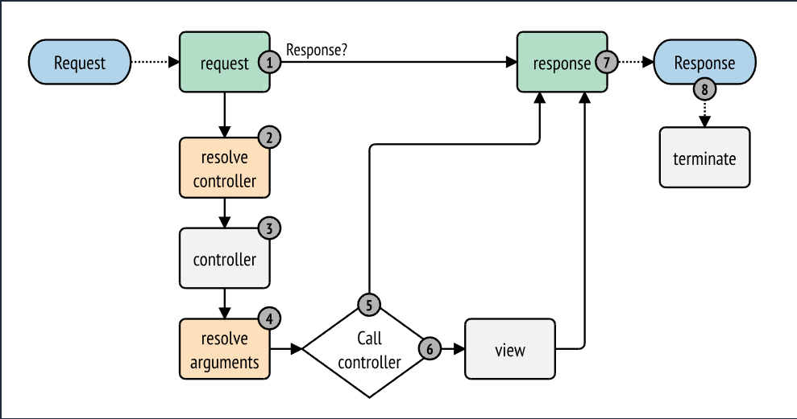
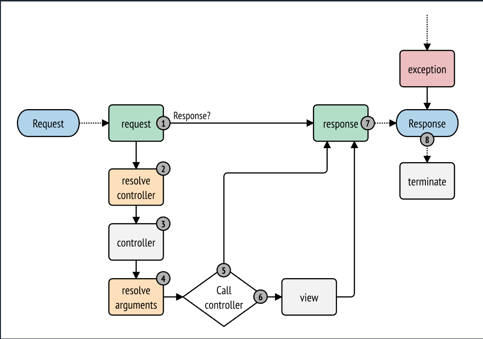
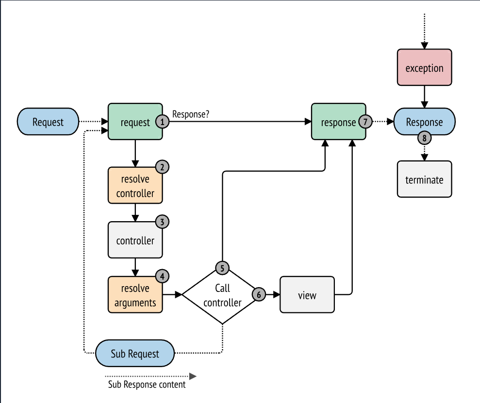

### HttpKernel Bileşeni

**Bu sayfayı düzenle**

HttpKernel bileşeni, EventDispatcher bileşeninden yararlanarak bir Request’i bir Response’a dönüştürmek için yapılandırılmış bir süreç sunar. Tam kapsamlı bir framework (Symfony) ya da gelişmiş bir CMS (Drupal) oluşturacak kadar esnektir.

---

#### Kurulum

```
composer require symfony/http-kernel
```

Bu bileşeni bir Symfony uygulaması dışında kurarsanız, Composer’ın sağladığı sınıf otomatik yükleme mekanizmasını etkinleştirmek için kodunuzda `vendor/autoload.php` dosyasını dahil etmeniz gerekir. Daha fazla ayrıntı için bu makaleyi okuyun.

---

### İstek–Yanıt Yaşam Döngüsü

Bu makale, HttpKernel özelliklerini herhangi bir PHP uygulamasında bağımsız bir bileşen olarak nasıl kullanacağınızı açıklar. Symfony uygulamalarında her şey zaten yapılandırılmış ve kullanıma hazırdır. Symfony uygulamalarında denetleyiciler oluşturmak ve olayları tanımlamak için nasıl kullanılacağını öğrenmek üzere **Controller** ve **Events and Event Listeners** makalelerini okuyun.

Her HTTP web etkileşimi bir istekle başlar ve bir yanıtla biter. Bir geliştirici olarak göreviniz, istek bilgilerini (örn. URL) okuyan ve bir yanıt (örn. bir HTML sayfası veya JSON dizesi) oluşturan PHP kodu yazmaktır. İşte Symfony uygulamalarında istek–yanıt yaşam döngüsünün basitleştirilmiş bir özeti:

1. Kullanıcı bir tarayıcıda bir kaynak talep eder;
2. Tarayıcı sunucuya bir istek gönderir;
3. Symfony uygulamaya bir **Request** nesnesi verir;
4. Uygulama, **Request** nesnesindeki verileri kullanarak bir **Response** nesnesi üretir;
5. Sunucu yanıtı tarayıcıya geri gönderir;
6. Tarayıcı kaynağı kullanıcıya gösterir.

Genellikle, geliştiricinin uygulamanın her sayfasını geliştirebilmesi için tüm tekrarlayan görevleri (örn. yönlendirme, güvenlik vb.) ele alan bir framework veya sistem oluşturulur. Bu sistemlerin tam olarak nasıl inşa edildiği büyük ölçüde değişir. **HttpKernel** bileşeni, bir istekle başlayıp uygun yanıtı oluşturmaya kadar olan süreci resmileştiren bir arayüz sağlar. Bileşen, sistemin mimarisi ne kadar farklı olursa olsun, herhangi bir uygulama ya da framework’ün kalbi olacak şekilde tasarlanmıştır:

```php
namespace Symfony\Component\HttpKernel;

use Symfony\Component\HttpFoundation\Request;

interface HttpKernelInterface
{
    // ...

    /**
     * @return Response A Response instance
     */
    public function handle(
        Request $request,
        int $type = self::MAIN_REQUEST,
        bool $catch = true
    ): Response;
}
```

Dahili olarak, **HttpKernel::handle()** —  **HttpKernelInterface::handle()** ’ın somut uygulaması — bir **Request** ile başlayan ve bir **Response** ile biten bir yaşam döngüsü tanımlar.




### HttpKernel: Olaylar Tarafından Yönetilen İstek–Yanıt Döngüsü

---

#### **Genel Bakış**

`HttpKernel::handle()` metodu, istek–yanıt döngüsünü **olay tabanlı (event-driven)** şekilde yönetir.

Bu, yöntemi hem **esnek** hem de biraz **soyut** hale getirir çünkü asıl işin büyük kısmı **event listener’lar** (olay dinleyiciler) tarafından gerçekleştirilir.

Symfony Framework bu mekanizmanın en kapsamlı uygulamasıdır.

Aşağıdaki örnek, HttpKernel bileşeninin temel çalışma mantığını göstermektedir:

```php
use Symfony\Component\EventDispatcher\EventDispatcher;
use Symfony\Component\HttpFoundation\Request;
use Symfony\Component\HttpFoundation\RequestStack;
use Symfony\Component\HttpKernel\Controller\ArgumentResolver;
use Symfony\Component\HttpKernel\Controller\ControllerResolver;
use Symfony\Component\HttpKernel\HttpKernel;

// Request nesnesi oluşturulur
$request = Request::createFromGlobals();

// Event Dispatcher oluşturulur
$dispatcher = new EventDispatcher();
// ... buraya event listener’lar eklenir

// Controller ve argüman çözücüleri oluşturulur
$controllerResolver = new ControllerResolver();
$argumentResolver = new ArgumentResolver();

// Kernel oluşturulur
$kernel = new HttpKernel($dispatcher, $controllerResolver, new RequestStack(), $argumentResolver);

// Kernel çalıştırılır — istek event’ler aracılığıyla işlenir
$response = $kernel->handle($request);

// Yanıt gönderilir
$response->send();

// kernel.terminate olayı tetiklenir
$kernel->terminate($request, $response);
```

> 🧩 Detaylı örnek için “A full working example” bölümüne bakınız.
>
> Event ekleme hakkında genel bilgi için:  **Creating an Event Listener** .

---

### 🌀 HttpKernel Yaşam Döngüsündeki Olaylar

Symfony çekirdeği, isteği işlerken sırasıyla aşağıdaki olayları tetikler:

1. **kernel.request**
2. **Controller çözümü (resolve controller)**
3. **kernel.controller**
4. **Argüman çözümü (get arguments)**
5. **Controller çağrısı ve yanıt oluşturma**
6. **kernel.response**
7. **kernel.terminate**

Aşağıda, bu adımların ilk dördü detaylı açıklanmıştır:

---

## 1️⃣ `kernel.request` Olayı

**Amaç:**

İstek üzerine bilgi eklemek, sistemi başlatmak ya da gerekirse doğrudan bir `Response` döndürmek.

**Örnek:**

* Güvenlik dinleyicisi (`security listener`) bir kullanıcının erişim yetkisi olmadığını belirlerse hemen bir `RedirectResponse` veya `403 Forbidden` dönebilir.
* Bu durumda işlem, doğrudan `kernel.response` aşamasına geçer.

**Alternatif olarak:**

Bazı dinleyiciler isteğe ek bilgiler ekler (örneğin: yerelleştirme – `locale` ayarı).

En yaygın dinleyicilerden biri  **RouterListener** ’dır.

RouterListener isteği işler, rotayı çözer ve `_controller` ile parametre bilgilerini **Request’in attributes** alanına ekler.

Bu bilgiler daha sonra `ControllerResolver` tarafından kullanılır.

> 🧠 Eğer bir listener `Response` döndürürse, olayın yayılımı (propagation) durur ve diğer düşük öncelikli listener’lar çalışmaz.

**Symfony’de:**

* `kernel.request` olayındaki en önemli listener: **RouterListener**

  Bu sınıf yönlendirme katmanını çalıştırır ve `_controller` dahil rota bilgilerini `Request->attributes` içine yerleştirir.

---

## 2️⃣ Controller’ı Çözümleme (Resolve the Controller)

Eğer `kernel.request` aşamasında bir `Response` oluşturulmadıysa, çekirdek bir **controller** belirlemelidir.

Controller, belirli bir sayfa için yanıt üreten PHP callable’dır (fonksiyon, sınıf metodu veya closure).

Bu işi yapan sınıf:

```php
Symfony\Component\HttpKernel\Controller\ControllerResolverInterface
```

```php
namespace Symfony\Component\HttpKernel\Controller;

use Symfony\Component\HttpFoundation\Request;

interface ControllerResolverInterface
{
    public function getController(Request $request): callable|false;
}
```

 **HttpKernel::handle()** , bu arabirimin `getController()` metodunu çağırarak controller’ı belirler.

---

### Symfony’de Controller Çözümleme

Symfony, **ControllerResolver** sınıfını (veya bazı ek özellikler içeren alt sınıfını) kullanır.

Bu sınıf, **RouterListener** tarafından Request’e eklenen `_controller` değerini kullanır.

**İşleyiş:**

a) `_controller` anahtarı, `App\Controller\DefaultController::index` gibi geçerli bir PHP callable formatında değilse, eski formatları (`FooBundle:Default:index`) yeni formata dönüştürür.

b) Controller sınıfı parametresiz olarak örneklenir.

Bu callable, artık çalıştırılabilir durumdadır.

---

## 3️⃣ `kernel.controller` Olayı

**Amaç:**

Controller belirlendikten sonra, çağrılmadan önce sistemin belirli bölümlerini başlatmak veya controller’ı değiştirmek.

**Kullanım örnekleri:**

* Profiler verilerinin toplanması,
* Controller üzerindeki PHP attribute’ların (`#[Cache]`, `#[Route]`, vb.) okunması,
* Controller callable’ının dinamik olarak değiştirilmesi.

**Symfony’de:**

* `CacheAttributeListener` dinleyicisi bu olayda çalışır.

  Controller üzerindeki `#[Cache]` attribute’larını okur ve yanıtın HTTP cache yapılandırmasını buna göre ayarlar.
* Diğer listener’lar (örneğin profiler) de bu aşamada devreye girer.

> ✏️ `ControllerEvent::setController()` metodu ile controller tamamen değiştirilebilir.

---

## 4️⃣ Controller Argümanlarını Çözümleme (Getting the Controller Arguments)

`HttpKernel::handle()`, controller belirlendikten sonra `ArgumentResolverInterface::getArguments()` metodunu çağırır.

Amaç: Controller’a iletilecek **argüman dizisini** belirlemektir.

Symfony’nin varsayılan `ArgumentResolver` sınıfı bu işi yapar.

**Symfony’de süreç:**

1. Controller callable’ın parametreleri reflection ile okunur.
2. Her parametre için uygun değer şu kurallarla belirlenir:
   a) **Request attributes** içinde aynı isimli bir anahtar varsa, değeri oradan alınır.

   (örneğin `$slug` → `Request->attributes['slug']`)
   b) Argüman türü `Request` ise, otomatik olarak geçerli `Request` nesnesi atanır.
   c) Eğer argüman **variadic** (örnek: `function foo(...$items)`) ise ve `Request attributes` içinde aynı isimde bir dizi varsa, tüm değerler bu argümana aktarılır.

Bu işlevsellik, `ValueResolverInterface`’i uygulayan **resolver** sınıfları tarafından sağlanır.

Symfony dört varsayılan resolver içerir, ancak siz kendi resolver’ınızı oluşturarak davranışı özelleştirebilirsiniz.

---

### 🎯 Özet Akış

| Aşama | Olay / İşlem        | Amaç                                                                  |
| ------ | --------------------- | ---------------------------------------------------------------------- |
| 1️⃣  | `kernel.request`    | İsteğe bilgi ekleme veya erken `Response`döndürme                |
| 2️⃣  | Controller Resolver   | Hangi controller’ın çağrılacağını belirleme                    |
| 3️⃣  | `kernel.controller` | Controller çağrılmadan önce sistem hazırlığı veya değiştirme |
| 4️⃣  | Argument Resolver     | Controller’a geçilecek argümanları belirleme                       |

---


### HttpKernel Yaşam Döngüsünün Son Aşamaları

*(5–9. Adımlar)*

---

## 5️⃣ Controller’ın Çağrılması (Calling the Controller)

Bu aşamada `HttpKernel::handle()` metodu, belirlenen controller’ı  **çalıştırır** .

Controller’ın görevi, belirli bir kaynak için **Response** üretmektir — bu bir HTML sayfası, JSON verisi veya başka bir çıktı olabilir.

Daha önceki tüm adımlar Symfony çekirdeği tarafından yönetilirken, **bu adım geliştirici tarafından** (her sayfa için ayrı) yazılır.

Controller genellikle bir `Response` nesnesi döndürür.

Bu durumda kernel’in işi neredeyse tamamlanmıştır ve bir sonraki adım **kernel.response** olayıdır.

Ancak controller, `Response` **harici bir değer** döndürürse (örneğin bir dizi veya nesne), kernel `kernel.view` olayını tetikler çünkü her durumda **amaç bir Response üretmektir.**

> ⚠️ Bir controller her zaman bir değer döndürmelidir.
>
> Eğer `null` döndürürse, hemen bir istisna (exception) fırlatılır.

---

## 6️⃣ `kernel.view` Olayı

**Amaç:**

Controller’ın `Response` yerine döndürdüğü başka bir değeri bir `Response`’a dönüştürmek.

Eğer controller bir `Response` döndürmemişse, kernel `kernel.view` olayını tetikler.

Bu olayın dinleyicileri (listeners), controller’ın döndürdüğü değeri (örneğin bir dizi veya nesne) kullanarak bir `Response` nesnesi oluşturur.

Bu yaklaşım genellikle bir “view katmanı” kullanmak isteyen uygulamalarda işe yarar:

Controller doğrudan bir `Response` döndürmek yerine, sayfayı temsil eden verileri döndürür.

Bir dinleyici bu veriyi uygun formata (örneğin HTML, JSON, XML) çevirir.

> Eğer bu aşamada hiçbir dinleyici `Response` üretmezse, bir istisna atılır.
>
> Bir dinleyici `Response` oluşturduğunda, olayın yayılımı (propagation) durur.

### Symfony’de `kernel.view` Olayı

Symfony Framework’te varsayılan bir listener mevcuttur:

* Controller, bir **array** döndürür ve eylem `#[Template]` attribute’una sahipse,

  listener bu diziyi belirtilen şablona gönderir, şablonu işler ve bir `Response` oluşturur.

Ek olarak:

* **FOSRestBundle** adlı popüler bir topluluk paketi de bu olayı dinler.

  Bu sayede aynı controller,  **HTML** ,  **JSON** , **XML** gibi farklı içerik tiplerinde yanıtlar üretebilir.

---

## 7️⃣ `kernel.response` Olayı

**Amaç:**

`Response` nesnesini istemciye gönderilmeden hemen önce değiştirmek.

Kernel’in nihai hedefi, `Request`’i bir `Response`’a dönüştürmektir.

Bu `Response`, şu kaynaklardan biriyle oluşturulmuş olabilir:

* `kernel.request` sırasında bir listener tarafından,
* Controller tarafından,
* `kernel.view` listener’ı tarafından.

Yanıt hangi aşamada oluşturulursa oluşturulsun, hemen ardından `kernel.response` olayı tetiklenir.

Bu olayın dinleyicileri genellikle `Response` üzerinde değişiklik yapar:

* Header ekleme veya düzenleme,
* Cookie ekleme,
* İçeriğe HTML/JavaScript enjekte etme (örneğin sayfa sonuna debug toolbar ekleme).

Sonrasında `HttpKernel::handle()` metodu nihai `Response` nesnesini döndürür.

Uygulamada genellikle şu şekilde olur:

```php
$response = $kernel->handle($request);
$response->send(); // header’lar ve içerik gönderilir
```

### Symfony’de `kernel.response` Olayı

Symfony Framework bu olaya çeşitli dinleyiciler bağlar:

* **WebDebugToolbarListener** → Geliştirme ortamında sayfanın altına debug toolbar’ı ekler.
* **ContextListener** → Geçerli kullanıcı bilgisini session’a yazar, böylece bir sonraki istekte geri yüklenebilir.

---

## 8️⃣ `kernel.terminate` Olayı

**Amaç:**

Yanıt istemciye gönderildikten **sonra** “ağır” işlemleri gerçekleştirmek.

Bu olay, `HttpKernel::handle()` tamamlandıktan ve `Response` gönderildikten sonra tetiklenir:

```php
$response->send();
$kernel->terminate($request, $response);
```

`kernel.terminate` olayı, genellikle istemciye yanıtı hızlıca döndürüp, sonrasında arkada çalışması gereken işlemleri yapmak için kullanılır.

Örneğin:

* E-posta gönderme,
* Log kaydı tutma,
* API çağrısı yapma gibi.

Symfony dahili olarak `fastcgi_finish_request()` fonksiyonunu kullanır.

Bu nedenle yalnızca **PHP-FPM** ve **FrankenPHP** sunucularında, yanıt gönderildikten sonra arka planda kod çalıştırılabilir.

Diğer PHP çalıştırma biçimlerinde (`mod_php`, `CLI`, vb.) yanıt kullanıcıya ancak tüm dinleyiciler tamamlandıktan sonra gönderilir.

> ⚙️ Bu olayı kullanmak için kernel’in  **TerminableInterface** ’i uygulaması gerekir.

---

## 9️⃣ `kernel.exception` Olayı

**Amaç:**

İşlem sırasında fırlatılan bir istisnayı yakalayıp, uygun bir `Response` üretmek.

`HttpKernel::handle()` metodu, iç yapısında bir `try...catch` bloğu barındırır.

İşlem sırasında bir istisna (exception) meydana geldiğinde `kernel.exception` olayı tetiklenir.

Bu olay, sisteminizin hatalara karşı nasıl tepki vereceğini belirlemenizi sağlar.

Bir dinleyici bu olayı yakalayarak:

* Hata sayfası döndürebilir (örneğin 404, 500),
* Kullanıcıyı yönlendirebilir,
* Loglama yapabilir.

> Symfony’nin kendi `ExceptionListener` sınıfı, bu olayı yönetir ve özel hata sayfalarını oluşturur.

---

### 🔄 Özet: HttpKernel’in Tüm Yaşam Döngüsü

| Adım | Olay                  | Amaç                                                                        |
| ----- | --------------------- | ---------------------------------------------------------------------------- |
| 1️⃣ | `kernel.request`    | İstek hazırlandı, Request’e bilgi eklendi veya erken `Response`döndü |
| 2️⃣ | Controller Resolver   | Hangi controller çağrılacak belirlendi                                    |
| 3️⃣ | `kernel.controller` | Controller çağrılmadan önce son hazırlıklar yapıldı                  |
| 4️⃣ | Argument Resolver     | Controller parametreleri çözümlendi                                       |
| 5️⃣ | Controller Execution  | Controller çalıştırıldı                                                |
| 6️⃣ | `kernel.view`       | Non-Response döndüyse `Response`’a dönüştürüldü                   |
| 7️⃣ | `kernel.response`   | `Response`istemciye gönderilmeden önce düzenlendi                       |
| 8️⃣ | `kernel.terminate`  | Yanıt sonrası işlemler (örn. e-posta, log) yapıldı                     |
| 9️⃣ | `kernel.exception`  | Hatalar yakalandı ve uygun `Response`üretildi                            |

---





### kernel.exception Olayı ve İlgili Dinleyiciler

Her dinleyiciye, orijinal istisnaya `getThrowable()` yöntemiyle erişebileceğiniz bir **ExceptionEvent** nesnesi aktarılır. Bu olay üzerindeki tipik bir dinleyici, belirli türdeki bir istisnayı kontrol eder ve uygun bir  **hata Response** ’u oluşturur.

Örneğin, bir **404** sayfası üretmek için özel bir istisna fırlatabilir ve bu istisnayı yakalayıp **404 Response** döndüren bir dinleyici ekleyebilirsiniz. Aslında, HttpKernel bileşeni varsayılan olarak bunu ve daha fazlasını yapan bir **ErrorListener** ile birlikte gelir (ayrıntılar için aşağıdaki kenar notuna bakın).

 **ExceptionEvent** , istisnanın atıldığı anda kernel’in şu anda sonlandırma aşamasında olup olmadığını belirlemek için kullanabileceğiniz **isKernelTerminating()** yöntemini sunar.

**7.1**

**isKernelTerminating()** yöntemi Symfony  **7.1** ’de tanıtıldı.

`kernel.exception` olayı için bir response ayarladığınızda,  **propagation durdurulur** . Bu, daha düşük öncelikli dinleyicilerin çalıştırılmayacağı anlamına gelir.

---

### Symfony Framework’te kernel.exception

Symfony Framework kullanılırken `kernel.exception` için iki ana dinleyici vardır.

#### HttpKernel Bileşenindeki ErrorListener

İlki, HttpKernel bileşeninin çekirdeğinde gelir ve **ErrorListener** olarak adlandırılır. Bu dinleyicinin birkaç hedefi vardır:

* Fırlatılan istisna, isteğe dair tüm bilgileri içeren ancak yazdırılabilir ve serileştirilebilir olan bir **FlattenException** nesnesine dönüştürülür.
* Orijinal istisna  **HttpExceptionInterface** ’i uyguluyorsa, **getStatusCode()** ve **getHeaders()** istisna üzerinden çağrılır ve  **FlattenException** ’ın durum kodu ve header’larını doldurmak için kullanılır. Amaç, nihai yanıt oluşturulurken bunların kullanılabilmesidir. Özel HTTP header’ları ayarlamak istiyorsanız, **HttpException** sınıfından türetilen istisnalarda **setHeaders()** yöntemini her zaman kullanabilirsiniz.
* Orijinal istisna  **RequestExceptionInterface** ’i uyguluyorsa,  **FlattenException** ’ın durum kodu **400** olarak ayarlanır ve başka hiçbir header değiştirilmez.
* Bir controller çalıştırılır ve bu controller’a düzleştirilmiş istisna ( **FlattenException** ) aktarılır. Hangi controller’ın render edeceği, bu dinleyicinin kurucu parametresi olarak iletilir. Bu controller, bu hata sayfası için  **nihai Response** ’u döndürür.

#### Security Bileşenindeki ExceptionListener

Diğer önemli dinleyici  **ExceptionListener** ’dır. Bu dinleyicinin amacı **güvenlik istisnalarını** ele almak ve uygun olduğunda kullanıcıya kimlik doğrulamasında yardımcı olmaktır (ör. giriş sayfasına yönlendirme).

---

### Bir Event Listener Oluşturma

Gördüğünüz gibi, **HttpKernel::handle()** döngüsü sırasında tetiklenen herhangi bir olaya event listener ekleyebilir ve bağlayabilirsiniz. Tipik olarak bir dinleyici, içinde yürütülen bir metoda sahip  **PHP sınıfıdır** , ancak herhangi bir şey olabilir. Event dinleyicileri oluşturma ve bağlama hakkında daha fazla bilgi için  **The EventDispatcher Component** ’e bakın.

Tüm “kernel” olaylarının adları **KernelEvents** sınıfında **sabit (constant)** olarak tanımlanmıştır. Ayrıca her event listener’a, sistemin mevcut durumu hakkında bilgi içeren ve  **KernelEvent** ’in bir alt sınıfı olan **tek bir argüman** aktarılır. Her olayın kendine özgü olay nesnesi vardır:

| Ad (Name)                   | KernelEvents Sabiti                | Dinleyiciye Aktarılan Argüman |
| --------------------------- | ---------------------------------- | ------------------------------- |
| kernel.request              | KernelEvents::REQUEST              | RequestEvent                    |
| kernel.controller           | KernelEvents::CONTROLLER           | ControllerEvent                 |
| kernel.controller_arguments | KernelEvents::CONTROLLER_ARGUMENTS | ControllerArgumentsEvent        |
| kernel.view                 | KernelEvents::VIEW                 | ViewEvent                       |
| kernel.response             | KernelEvents::RESPONSE             | ResponseEvent                   |
| kernel.finish_request       | KernelEvents::FINISH_REQUEST       | FinishRequestEvent              |
| kernel.terminate            | KernelEvents::TERMINATE            | TerminateEvent                  |
| kernel.exception            | KernelEvents::EXCEPTION            | ExceptionEvent                  |

---

### Çalışan Bir Örnek (A full Working Example)

HttpKernel bileşenini kullanırken, çekirdek olaylara istediğiniz dinleyicileri bağlamakta,  **ControllerResolverInterface** ’i uygulayan herhangi bir controller çözücüyü ve  **ArgumentResolverInterface** ’i uygulayan herhangi bir argüman çözücüyü kullanmakta özgürsünüz. Yine de HttpKernel bileşeni, çalışan bir örnek oluşturmak için kullanılabilecek bazı yerleşik dinleyiciler ve diğer her şeyi sağlar:

```php
use Symfony\Component\EventDispatcher\EventDispatcher;
use Symfony\Component\HttpFoundation\Request;
use Symfony\Component\HttpFoundation\RequestStack;
use Symfony\Component\HttpFoundation\Response;
use Symfony\Component\HttpKernel\Controller\ArgumentResolver;
use Symfony\Component\HttpKernel\Controller\ControllerResolver;
use Symfony\Component\HttpKernel\EventListener\RouterListener;
use Symfony\Component\HttpKernel\HttpKernel;
use Symfony\Component\Routing\Matcher\UrlMatcher;
use Symfony\Component\Routing\RequestContext;
use Symfony\Component\Routing\Route;
use Symfony\Component\Routing\RouteCollection;

$routes = new RouteCollection();
$routes->add('hello', new Route('/hello/{name}', [
    '_controller' => function (Request $request): Response {
        return new Response(
            sprintf("Hello %s", $request->get('name'))
        );
    }]
));

$request = Request::createFromGlobals();

$matcher = new UrlMatcher($routes, new RequestContext());

$dispatcher = new EventDispatcher();
$dispatcher->addSubscriber(new RouterListener($matcher, new RequestStack()));

$controllerResolver = new ControllerResolver();
$argumentResolver = new ArgumentResolver();

$kernel = new HttpKernel($dispatcher, $controllerResolver, new RequestStack(), $argumentResolver);

$response = $kernel->handle($request);
$response->send();

$kernel->terminate($request, $response);
```

---

### Alt İstekler (Sub Requests)

`HttpKernel::handle()` metoduna gönderilen “ana” isteğe ek olarak, **alt istek** (sub request) de gönderebilirsiniz. Alt istekler, diğer istekler gibi görünür ve davranır; ancak genellikle tam sayfa yerine **sayfanın küçük bir bölümünü** render etmek için kullanılır. En yaygın olarak controller içinden (ya da controller’ın render ettiği bir şablon içinden) alt istek yaparsınız.





### Alt İsteklerin (Sub Requests) Yürütülmesi

Symfony’nin **HttpKernel** bileşeni, yalnızca ana isteği (`main request`) değil, aynı zamanda **alt istekleri (sub requests)** de işleyebilir.

Alt istekler, sistemin içinde yeni bir istek–yanıt döngüsü başlatır, fakat genellikle bir sayfanın tamamını değil — **sadece belirli bir bölümünü** render etmek için kullanılır.

---

#### 🔧 Alt İstek Oluşturma ve Çalıştırma

Bir alt isteği çalıştırmak için yine `HttpKernel::handle()` metodunu kullanırsınız,

ancak ikinci parametreyi **HttpKernelInterface::SUB_REQUEST** olarak değiştirirsiniz:

```php
use Symfony\Component\HttpFoundation\Request;
use Symfony\Component\HttpKernel\HttpKernelInterface;

// yeni bir Request oluşturulur
$request = new Request();

// örneğin bu isteğe özel bir controller atanabilir
$request->attributes->set('_controller', 'App\\Controller\\SomeController::index');

// alt isteği çalıştır
$response = $kernel->handle($request, HttpKernelInterface::SUB_REQUEST);

// yanıtla bir işlem yap
$content = $response->getContent();
```

Bu işlem, tıpkı ana istek gibi **yeni bir tam istek–yanıt döngüsü** başlatır.

Ancak dahili olarak bazı dinleyiciler (örneğin güvenlik –  *security listener* )

sadece ana istek üzerinde çalışır ve alt isteklere tepki vermez.

---

#### 🧩 Dinleyicilerde Alt İstek Kontrolü

Her event listener’a, olayın bir alt mı yoksa ana istek mi olduğunu anlamak için kullanılabilecek

`isMainRequest()` metodu olan bir **KernelEvent** alt sınıfı aktarılır.

Örneğin, yalnızca ana istekte çalışacak bir dinleyici şöyle görünür:

```php
use Symfony\Component\HttpKernel\Event\RequestEvent;

public function onKernelRequest(RequestEvent $event): void
{
    if (!$event->isMainRequest()) {
        return; // alt isteklerde çalışmaz
    }

    // yalnızca ana istekte yapılacak işlemler
}
```

> 🔍 Not: Symfony 5.3 öncesinde bu yöntem `isMasterRequest()` olarak adlandırılıyordu.

---

#### ⚙️ Alt İstek Formatını Belirtme

Varsayılan olarak, her isteğin `_format` attribute değeri `"html"`’dür.

Eğer alt isteğiniz farklı bir içerik formatı döndürecekse (örneğin `"json"`),

bunu açıkça tanımlayabilirsiniz:

```php
$request->attributes->set('_format', 'json');
```

Bu, yanıtın MIME tipini veya şablon seçimini etkileyebilir.

---

### Kaynakların Bulunması (Locating Resources)

`HttpKernel` bileşeni, Symfony uygulamalarında **bundle mekanizmasından** sorumludur.

Bundle’ların en önemli özelliklerinden biri, fiziksel dosya yollarını bilmeden

**mantıksal yollarla** (logical paths) kaynaklara erişebilmenizi sağlamasıdır.

Örneğin, `FooBundle` adlı bir bundle’daki `Resources/config/services.xml` dosyasına

şöyle erişebilirsiniz:

```
@FooBundle/Resources/config/services.xml
```

Bu sayede bundle’ın dosya sistemindeki gerçek konumunu bilmenize gerek kalmaz.

`HttpKernel` bunu `locateResource()` metodu aracılığıyla yapar.

Bu metot, **mantıksal yolu fiziksel bir dosya yoluna dönüştürür:**

```php
$path = $kernel->locateResource('@FooBundle/Resources/config/services.xml');
```

Böylece, dosya sistemi konumu değişse bile bundle içindeki kaynaklara güvenli bir şekilde erişebilirsiniz.

---

### 🧭 Özet

| Özellik                           | Açıklama                                                         |
| ---------------------------------- | ------------------------------------------------------------------ |
| **Alt istek çalıştırma** | `HttpKernel::handle($request, HttpKernelInterface::SUB_REQUEST)` |
| **Ana isteği tespit etme**  | `$event->isMainRequest()`                                        |
| **Alt istek formatı**       | `$request->attributes->set('_format', 'json')`                   |
| **Bundle kaynağı bulma**   | `$kernel->locateResource('@MyBundle/path/to/file')`              |
