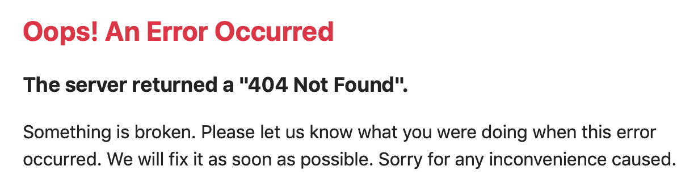

# Hata Sayfalarını Özelleştirme (Customize Error Pages)


```markdown


Symfony uygulamalarında, tüm hatalar birer **exception (istisna)** olarak ele alınır.  
Bu, ister bir **404 Not Found (Bulunamadı)** hatası olsun, ister kod içinde fırlatılmış bir **fatal error (ölümcül hata)** olsun fark etmez — Symfony bunları **istisna** olarak değerlendirir.

Geliştirme (development) ortamında Symfony, oluşan tüm istisnaları yakalar ve hatanın nedenini anlamanı kolaylaştırmak için ayrıntılı **debug (hata ayıklama)** bilgileri içeren özel bir hata sayfası gösterir.

---

## 🧩 Üretim Ortamında (Production Environment)

Üretim ortamında ise kullanıcıya teknik detaylar gösterilmez.  
Bunun yerine Symfony, hata türüne göre uygun bir hata sayfası gösterir.  
Varsayılan olarak, bu sayfalar `templates/bundles/TwigBundle/Exception/` dizininde bulunur.

Aşağıdaki şablonları oluşturarak hata sayfalarını özelleştirebilirsin:

| Hata Kodu | Şablon Dosyası Adı | Açıklama |
|------------|--------------------|-----------|
| 404 | `error404.html.twig` | Sayfa bulunamadığında gösterilir. |
| 403 | `error403.html.twig` | Erişim izni olmadığında gösterilir. |
| 500 | `error500.html.twig` | Sunucu tarafı genel bir hata olduğunda gösterilir. |
| Genel (tüm hatalar) | `error.html.twig` | Herhangi bir özel hata sayfası yoksa bu dosya kullanılır. |

📂 **Dizin yapısı örneği:**
```

templates/

└── bundles/

└── TwigBundle/

└── Exception/

├── error.html.twig

├── error404.html.twig

├── error403.html.twig

└── error500.html.twig

```

---

## 🧠 Twig Şablonu Örneği

`templates/bundles/TwigBundle/Exception/error404.html.twig` dosyasını oluştur:

```twig


Sayfa Bulunamadı


    <div class="text-center mt-10">
        <h1>😕 404 - Sayfa Bulunamadı</h1>
        <p>Aradığınız sayfa mevcut değil veya taşınmış olabilir.</p>
        <a href="{{ path('app_home') }}" class="btn btn-primary mt-3">Ana Sayfaya Dön</a>
    </div>

```

---

## ⚙️ Dinamik İçerik Kullanımı

Hata şablonlarında şu Twig değişkenlerini kullanabilirsin:

| Değişken      | Açıklama                                                     |
| --------------- | -------------------------------------------------------------- |
| `status_code` | HTTP hata kodu (örneğin `404`,`500`).                    |
| `status_text` | Hata açıklaması (`Not Found`,`Internal Server Error`).  |
| `exception`   | Gerçek exception nesnesi (sadece debug açıkken görünür). |

Örnek:

```twig
<h2>Hata {{ status_code }} - {{ status_text }}</h2>
```

---

## 🧩 Özel Exception Denetimi

Bazı özel istisnalar için özel sayfa göstermek istiyorsan, bir **Event Listener** veya **Controller** ile `ExceptionEvent` olayını dinleyebilirsin.

Örnek (Event Subscriber):

```php
namespace App\EventSubscriber;

use Symfony\Component\EventDispatcher\EventSubscriberInterface;
use Symfony\Component\HttpKernel\Event\ExceptionEvent;
use Symfony\Component\HttpFoundation\Response;
use Symfony\Component\HttpKernel\Exception\NotFoundHttpException;
use Twig\Environment;

class ExceptionSubscriber implements EventSubscriberInterface
{
    public function __construct(private Environment $twig) {}

    public function onKernelException(ExceptionEvent $event): void
    {
        $exception = $event->getThrowable();

        if ($exception instanceof NotFoundHttpException) {
            $response = new Response(
                $this->twig->render('errors/custom_404.html.twig'),
                Response::HTTP_NOT_FOUND
            );
            $event->setResponse($response);
        }
    }

    public static function getSubscribedEvents(): array
    {
        return ['kernel.exception' => 'onKernelException'];
    }
}
```

---

## 🎨 İpucu

Özel hata sayfalarına CSS ve JavaScript ekleyebilirsin.

Ancak dikkat et: hata sırasında statik dosyalar da yüklenemeyebilir. Bu nedenle hata sayfalarını **minimum bağımlılıkla** tasarlamak en iyi uygulamadır.

---

✅ **Özetle:**

* Tüm hatalar Symfony’de exception olarak ele alınır.
* Twig şablonlarıyla özel hata sayfaları oluşturulabilir.
* `kernel.exception` olayını dinleyerek özel davranışlar eklenebilir.
* Üretim ortamında kullanıcıya sade ve güvenli bir sayfa gösterilir.

```

```


```markdown
Üretim (Production) ortamında, bu hata sayfaları **çok sayıda hassas iç bilgi** (örneğin hata izleri, dosya yolları, değişken değerleri vb.) içerdiğinden Symfony bunları **kullanıcıya göstermez**.  

Bunun yerine, Symfony **basit ve genel bir hata sayfası (minimal generic error page)** görüntüler.  
Bu sayfa yalnızca kullanıcının bir hata olduğunu anlamasını sağlar, ancak hata ile ilgili teknik ayrıntıları gizler.

---

## 🧩 Varsayılan Üretim Hata Sayfası

Üretim ortamında Symfony’nin gösterdiği sayfa şu şekilde minimaldir:

```

# Oops! An Error Occurred

The server returned a "500 Internal Server Error".

```

Bu sayfa sadece HTTP durum kodunu ve kısa bir açıklamayı içerir.  
Amaç, güvenliği korumak ve uygulamanın iç yapısı hakkında bilgi sızmasını engellemektir.

---

## 🎨 Kendi Üretim Hata Sayfalarını Oluşturmak

Kendi minimal ama markalı hata sayfalarını oluşturmak istiyorsan, Symfony’nin hata şablon sistemini kullanabilirsin.  
Bu şablonlar `templates/bundles/TwigBundle/Exception/` dizininde bulunur.

Örnek olarak 500 hata sayfası oluşturmak için:

📄 **templates/bundles/TwigBundle/Exception/error500.html.twig**

```twig


Sunucu Hatası


    <div class="text-center mt-10">
        <h1>😵 500 - Sunucu Hatası</h1>
        <p>Bir şeyler ters gitti. Ekiplerimiz durumu inceliyor.</p>
        <a href="{{ path('app_home') }}" class="btn btn-secondary mt-3">Ana Sayfaya Dön</a>
    </div>

```

Symfony üretim modunda (`APP_ENV=prod`), artık bu özel sayfayı gösterecektir.

---

## ⚙️ Hata Sayfalarını Test Etmek

Hata sayfalarını test etmek için geçici olarak üretim ortamını simüle edebilirsin:

```bash
APP_ENV=prod APP_DEBUG=0 symfony serve
```

Bu şekilde debug ekranı devre dışı kalır ve kullanıcıya gösterilecek gerçek hata sayfalarını görebilirsin.

---

✅ **Özetle:**

* Symfony, üretim ortamında debug bilgilerini  **gizler** .
* Kullanıcıya sadece **genel bir hata mesajı** gösterilir.
* İstersen bu genel sayfayı özelleştirmek için Twig şablonları oluşturabilirsin.

```

```





# Üretim Ortamı Hata Sayfalarını Özelleştirme (Customizing Production Error Pages)


```markdown


Symfony, üretim ortamında hata sayfalarını özelleştirmek için farklı seviyelerde esneklik sunar.  
İhtiyacına göre aşağıdaki yöntemlerden birini kullanabilirsin 👇

---

## 🧩 1. Sadece Sayfa İçeriğini ve Stilini Değiştirmek İstiyorsan

Uygulamanın tasarımıyla uyumlu hale getirmek için **varsayılan hata şablonlarını (error templates)** özelleştirebilirsin.

### ⚙️ Gerekli Paketleri Yükle
```bash
composer require symfony/twig-pack
```

Symfony, hata sayfası yüklendiğinde Twig şablonlarını oluşturmak için **TwigErrorRenderer** bileşenini kullanır.

Bu bileşen şu mantığı izler:

1. Önce hata koduna özel bir şablon arar (`error500.html.twig` gibi).
2. Eğer bulunmazsa genel bir `error.html.twig` dosyasını kullanır.

### 📂 Şablon Dizini

Varsayılan şablonlar şu dizindedir:

```
templates/
└── bundles/
    └── TwigBundle/
        └── Exception/
            ├── error404.html.twig
            ├── error403.html.twig
            └── error.html.twig   # Tüm diğer hatalar (örneğin 500)
```

---

## 🧱 404 Sayfası Örneği

📄 `templates/bundles/TwigBundle/Exception/error404.html.twig`

```twig



    <h1>Sayfa Bulunamadı</h1>

    <p>
        Aradığınız sayfa bulunamadı. Lütfen URL’yi kontrol edin veya
        <a href="{{ path('homepage') }}">ana sayfaya dönün</a>.
    </p>

```

---

## 🧠 Twig Değişkenleri

TwigErrorRenderer, şablonlara bazı değişkenler gönderir:

| Değişken      | Açıklama                                                      |
| --------------- | --------------------------------------------------------------- |
| `status_code` | HTTP hata kodu (örneğin `404`,`500`).                     |
| `status_text` | Hata metni (örneğin `Not Found`,`Internal Server Error`). |
| `exception`   | Gerçek `HttpException`nesnesi.                               |

Örnek:

```twig
<p>Hata Kodu: {{ status_code }} - {{ status_text }}</p>
<p>Mesaj: {{ exception.message }}</p>
```

> ⚠️ `{{ exception.traceAsString }}` ile yığın izini (stack trace) de yazdırabilirsin ama **güvenlik nedeniyle kullanıcıya göstermemelisin.**

---

## ⚙️ HTTP Durum Kodunu Özelleştirmek

Kendi exception sınıfında `HttpExceptionInterface`’i uygulayarak özel bir `status_code` döndürebilirsin:

```php
use Symfony\Component\HttpKernel\Exception\HttpExceptionInterface;

class CustomException extends \Exception implements HttpExceptionInterface
{
    public function getStatusCode(): int
    {
        return 418; // örneğin “I'm a teapot” :)
    }

    public function getHeaders(): array
    {
        return [];
    }
}
```

---

## 🔒 Güvenlik ve 404 Sayfaları

Symfony’nin yükleme sırası nedeniyle, **security (güvenlik)** bilgileri 404 sayfalarında  **kullanılamaz** .

Yani kullanıcı giriş yapmış olsa bile, 404 sayfasında **çıkış yapmış gibi** görünebilir.

Bu durum geliştirme ortamında değil, yalnızca **üretim ortamında** geçerlidir.

---

## 🧪 Geliştirme Ortamında Hata Sayfalarını Test Etme

Geliştirme ortamında (APP_ENV=dev), Symfony hata yerine **debug ekranını** gösterir.

Yeni şablonlarını test etmek için özel rotalar ekleyebilirsin.

📄 **config/routes/framework.php**

```php
use Symfony\Component\Routing\Loader\Configurator\RoutingConfigurator;

return function (RoutingConfigurator $routes): void {
    if ('dev' === $routes->env()) {
        $routes->import('@FrameworkBundle/Resources/config/routing/errors.php', 'php')
            ->prefix('/_error');
    }
};
```

Artık aşağıdaki URL’leri kullanarak hata sayfalarını test edebilirsin:

| Amaç                                | URL                                               |
| ------------------------------------ | ------------------------------------------------- |
| HTML hata sayfası test etmek        | `http://localhost/_error/{statusCode}`          |
| Belirli bir formatta hata test etmek | `http://localhost/_error/{statusCode}.{format}` |

> 📦 Bu özellik Symfony **7.3** ile birlikte gelen `errors.php` dosyasıyla eklendi.
>
> Daha önceki sürümlerde `errors.xml` dosyası kullanılıyordu.

---

## 🧩 2. HTML Dışındaki Formatlar İçin Hata Çıktısını Özelleştirmek

Eğer uygulaman API döndürüyorsa (JSON, XML, CSV, YAML vb.), **Serializer Component** kullanarak çıktı biçimini özelleştirebilirsin.

### ⚙️ Gerekli Paket:

```bash
composer require symfony/serializer-pack
```

Symfony, varsayılan olarak `FlattenException` normalizer (ProblemNormalizer) kullanır.

Ancak sen kendi **Normalizer** sınıfını oluşturarak çıktı yapısını değiştirebilirsin:

📄 **src/Serializer/MyCustomProblemNormalizer.php**

```php
namespace App\Serializer;

use Symfony\Component\ErrorHandler\Exception\FlattenException;
use Symfony\Component\Serializer\Normalizer\NormalizerInterface;

class MyCustomProblemNormalizer implements NormalizerInterface
{
    public function normalize($exception, ?string $format = null, array $context = []): array
    {
        return [
            'content' => 'Bu benim özel problem normalizer’ım.',
            'exception'=> [
                'message' => $exception->getMessage(),
                'code' => $exception->getStatusCode(),
            ],
        ];
    }

    public function supportsNormalization($data, ?string $format = null, array $context = []): bool
    {
        return $data instanceof FlattenException;
    }
}
```

---

## 🧠 3. Symfony’nin Hata Üretme Mantığını Değiştirmek

Symfony’nin hata sayfalarını oluşturma mantığını değiştirmek istersen,

**varsayılan error controller’ı** (`ErrorController`) override edebilirsin.

---

## ⚡ 4. Tüm Hata Yönetimini Kendin Üstlenmek İstiyorsan

Uygulamanın hata yönetimini tamamen özelleştirmek istiyorsan,

`kernel.exception` olayını dinleyen bir **Event Subscriber** yazabilirsin.

Bu sayede kendi mantığınla özel yanıt (Response) döndürebilirsin.

---

✅ **Özetle:**

| Amaç                                               | Yöntem                                                   |
| --------------------------------------------------- | --------------------------------------------------------- |
| Hata sayfası görünümünü değiştirmek         | Twig şablonlarını override et (`errorXXX.html.twig`) |
| JSON / XML hata çıktısını değiştirmek        | Kendi `Normalizer`sınıfını yaz                      |
| Symfony hata oluşturma mantığını değiştirmek | `ErrorController`’ı override et                       |
| Tam kontrol istiyorsan                              | `kernel.exception`olayını dinle                       |


# Varsayılan ErrorController'ı (Hata Denetleyicisi) Geçersiz Kılma


```markdown


Varsayılan Twig hata şablonlarını özelleştirmek yeterli gelmiyorsa — örneğin hata sayfasına **ek değişkenler geçirmek** istiyorsan — Symfony’nin kullandığı **ErrorController**’ı değiştirebilirsin.

---

## 🧩 Kendi Hata Denetleyicini Yazmak

Yeni bir controller sınıfı oluştur ve framework yapılandırmasında Symfony’ye bu sınıfı kullanmasını söyle:

📄 **config/packages/framework.php**
```php
use Symfony\Config\FrameworkConfig;

return static function (FrameworkConfig $framework): void {
    // ...
    $framework->errorController('App\\Controller\\ErrorController::show');
};
```

---

## 🧠 ErrorController Örneği

📄 **src/Controller/ErrorController.php**

```php
namespace App\Controller;

use Symfony\Component\HttpFoundation\Response;
use Symfony\Component\HttpKernel\Log\DebugLoggerInterface;
use Throwable;
use Twig\Environment;

class ErrorController
{
    public function __construct(private Environment $twig) {}

    public function show(Throwable $exception, ?DebugLoggerInterface $logger): Response
    {
        // Hata mesajını logla
        if ($logger) {
            $logger->error($exception->getMessage());
        }

        // Şablona özel veriler gönder
        return new Response(
            $this->twig->render('error/custom_error.html.twig', [
                'status_code' => $exception->getCode() ?: 500,
                'message' => $exception->getMessage(),
            ])
        );
    }
}
```

Bu controller’a Symfony otomatik olarak iki parametre gönderir:

| Parametre     | Açıklama                                                           |
| ------------- | -------------------------------------------------------------------- |
| `exception` | Yakalanan orijinal `Throwable`nesnesi                              |
| `logger`    | `DebugLoggerInterface`örneği (bazı durumlarda `null`olabilir) |

💡 Bu yöntemle oluşturduğun hata sayfaları da **preview (önizleme)** özelliğini destekler — yani `/_error/{code}` rotasıyla test edebilirsin.

---

# kernel.exception Olayıyla Çalışmak

Symfony’nin **HttpKernel** bileşeni, bir istisna fırlatıldığında (`throw`) bunu yakalar ve bir **`kernel.exception` olayı** tetikler.

Bu olay, istisnaları özelleştirerek işleyebilmeni sağlar.

---

## ⚙️ Event Listener ile Hata Yönetimi

Kendi  **event listener** ’ını oluşturarak istisneleri yakalayıp, farklı durumlara özel tepkiler verebilirsin.

📄 **src/EventSubscriber/ExceptionSubscriber.php**

```php
namespace App\EventSubscriber;

use Symfony\Component\EventDispatcher\EventSubscriberInterface;
use Symfony\Component\HttpKernel\Event\ExceptionEvent;
use Symfony\Component\HttpFoundation\RedirectResponse;
use Symfony\Component\HttpFoundation\Response;
use Symfony\Component\Routing\Generator\UrlGeneratorInterface;
use Symfony\Component\HttpKernel\Exception\NotFoundHttpException;

class ExceptionSubscriber implements EventSubscriberInterface
{
    public function __construct(private UrlGeneratorInterface $urlGenerator) {}

    public function onKernelException(ExceptionEvent $event): void
    {
        $exception = $event->getThrowable();

        // 404 hatalarında özel sayfa
        if ($exception instanceof NotFoundHttpException) {
            $response = new Response('Sayfa bulunamadı!', Response::HTTP_NOT_FOUND);
            $event->setResponse($response);
            return;
        }

        // Özel exception için yönlendirme
        if ($exception->getMessage() === 'login_required') {
            $url = $this->urlGenerator->generate('app_login');
            $event->setResponse(new RedirectResponse($url));
            return;
        }
    }

    public static function getSubscribedEvents(): array
    {
        return ['kernel.exception' => 'onKernelException'];
    }
}
```

> `setResponse()` metodu çağrıldığında olay yayılımı durdurulur ve yanıt doğrudan kullanıcıya gönderilir.

Bu yöntem, farklı controller’larda aynı hatayı tekrar tekrar yakalamak yerine

**merkezi bir hata yönetimi** sağlar.

---

## 🧱 Gerçek Bir Örnek: ExceptionListener

Symfony’nin kendi **`ExceptionListener`** sınıfı buna iyi bir örnektir.

Bu listener, güvenlik (security) ile ilgili istisnaları (örneğin `AccessDeniedException`) yakalar ve kullanıcıyı giriş sayfasına yönlendirme, oturumu sonlandırma gibi işlemler yapar.

---

# 🧾 Hata Sayfalarını Statik HTML Dosyaları Olarak Yayınlamak

> 🆕 Symfony 7.3 ile gelen yeni özellik.

Bazı durumlarda hata, Symfony uygulamasına ulaşmadan önce (örneğin PHP yüklenmeden veya uygulama çöktüğünde) oluşabilir.

Bu gibi durumlarda, **web sunucusu kendi varsayılan hata sayfalarını** gösterir.

Symfony’nin yeni **`error:dump`** komutu sayesinde, hata sayfalarını statik HTML dosyaları olarak önceden oluşturup sunucuya koyabilirsin.

Bu, hem  **performansı artırır** , hem de **kullanıcının her zaman senin tasarladığın hata sayfasını görmesini** sağlar.

---

## ⚙️ Statik Hata Sayfalarını Oluşturma

```bash
APP_ENV=prod php bin/console error:dump var/cache/prod/error_pages/
```

Belirli hata kodlarını belirtmek istersen:

```bash
APP_ENV=prod php bin/console error:dump var/cache/prod/error_pages/ 401 403 404 500
```

Bu komut `var/cache/prod/error_pages/` dizininde `.html` dosyaları oluşturur.

---

## 🌐 Nginx Üzerinde Yapılandırma Örneği

📄 **/etc/nginx/conf.d/example.com.conf**

```nginx
server {
    # Mevcut yapılandırma
    # ...

    # Statik hata sayfaları tanımla
    error_page 400 /error_pages/400.html;
    error_page 401 /error_pages/401.html;
    error_page 403 /error_pages/403.html;
    error_page 404 /error_pages/404.html;
    error_page 500 /error_pages/500.html;
    error_page 510 /error_pages/510.html;
    error_page 511 /error_pages/511.html;

    location ^~ /error_pages/ {
        root /path/to/your/symfony/var/cache/prod;
        internal; # Doğrudan erişimi engeller
    }
}
```

---

✅ **Özetle:**

| Amaç                                                  | Yöntem                                                  |
| ------------------------------------------------------ | -------------------------------------------------------- |
| Twig şablonlarına ekstra veri geçirmek              | Kendi `ErrorController`sınıfını yaz                |
| Farklı exception türleri için özel tepki vermek    | `kernel.exception`olayını dinleyen listener oluştur |
| Uygulama çökerse bile özel hata sayfası göstermek | `error:dump`komutu ile statik HTML sayfaları oluştur |

```

```

```markdown
# Varsayılan ErrorController'ı (Hata Denetleyicisi) Geçersiz Kılma

Varsayılan Twig hata şablonlarını özelleştirmek yeterli gelmiyorsa — örneğin hata sayfasına **ek değişkenler geçirmek** istiyorsan — Symfony’nin kullandığı **ErrorController**’ı değiştirebilirsin.

---

## 🧩 Kendi Hata Denetleyicini Yazmak

Yeni bir controller sınıfı oluştur ve framework yapılandırmasında Symfony’ye bu sınıfı kullanmasını söyle:

📄 **config/packages/framework.php**
```php
use Symfony\Config\FrameworkConfig;

return static function (FrameworkConfig $framework): void {
    // ...
    $framework->errorController('App\\Controller\\ErrorController::show');
};
```

---

## 🧠 ErrorController Örneği

📄 **src/Controller/ErrorController.php**

```php
namespace App\Controller;

use Symfony\Component\HttpFoundation\Response;
use Symfony\Component\HttpKernel\Log\DebugLoggerInterface;
use Throwable;
use Twig\Environment;

class ErrorController
{
    public function __construct(private Environment $twig) {}

    public function show(Throwable $exception, ?DebugLoggerInterface $logger): Response
    {
        // Hata mesajını logla
        if ($logger) {
            $logger->error($exception->getMessage());
        }

        // Şablona özel veriler gönder
        return new Response(
            $this->twig->render('error/custom_error.html.twig', [
                'status_code' => $exception->getCode() ?: 500,
                'message' => $exception->getMessage(),
            ])
        );
    }
}
```

Bu controller’a Symfony otomatik olarak iki parametre gönderir:

| Parametre     | Açıklama                                                           |
| ------------- | -------------------------------------------------------------------- |
| `exception` | Yakalanan orijinal `Throwable`nesnesi                              |
| `logger`    | `DebugLoggerInterface`örneği (bazı durumlarda `null`olabilir) |

💡 Bu yöntemle oluşturduğun hata sayfaları da **preview (önizleme)** özelliğini destekler — yani `/_error/{code}` rotasıyla test edebilirsin.

---

# kernel.exception Olayıyla Çalışmak

Symfony’nin **HttpKernel** bileşeni, bir istisna fırlatıldığında (`throw`) bunu yakalar ve bir **`kernel.exception` olayı** tetikler.

Bu olay, istisnaları özelleştirerek işleyebilmeni sağlar.

---

## ⚙️ Event Listener ile Hata Yönetimi

Kendi  **event listener** ’ını oluşturarak istisneleri yakalayıp, farklı durumlara özel tepkiler verebilirsin.

📄 **src/EventSubscriber/ExceptionSubscriber.php**

```php
namespace App\EventSubscriber;

use Symfony\Component\EventDispatcher\EventSubscriberInterface;
use Symfony\Component\HttpKernel\Event\ExceptionEvent;
use Symfony\Component\HttpFoundation\RedirectResponse;
use Symfony\Component\HttpFoundation\Response;
use Symfony\Component\Routing\Generator\UrlGeneratorInterface;
use Symfony\Component\HttpKernel\Exception\NotFoundHttpException;

class ExceptionSubscriber implements EventSubscriberInterface
{
    public function __construct(private UrlGeneratorInterface $urlGenerator) {}

    public function onKernelException(ExceptionEvent $event): void
    {
        $exception = $event->getThrowable();

        // 404 hatalarında özel sayfa
        if ($exception instanceof NotFoundHttpException) {
            $response = new Response('Sayfa bulunamadı!', Response::HTTP_NOT_FOUND);
            $event->setResponse($response);
            return;
        }

        // Özel exception için yönlendirme
        if ($exception->getMessage() === 'login_required') {
            $url = $this->urlGenerator->generate('app_login');
            $event->setResponse(new RedirectResponse($url));
            return;
        }
    }

    public static function getSubscribedEvents(): array
    {
        return ['kernel.exception' => 'onKernelException'];
    }
}
```

> `setResponse()` metodu çağrıldığında olay yayılımı durdurulur ve yanıt doğrudan kullanıcıya gönderilir.

Bu yöntem, farklı controller’larda aynı hatayı tekrar tekrar yakalamak yerine

**merkezi bir hata yönetimi** sağlar.

---

## 🧱 Gerçek Bir Örnek: ExceptionListener

Symfony’nin kendi **`ExceptionListener`** sınıfı buna iyi bir örnektir.

Bu listener, güvenlik (security) ile ilgili istisnaları (örneğin `AccessDeniedException`) yakalar ve kullanıcıyı giriş sayfasına yönlendirme, oturumu sonlandırma gibi işlemler yapar.

---

# 🧾 Hata Sayfalarını Statik HTML Dosyaları Olarak Yayınlamak

> 🆕 Symfony 7.3 ile gelen yeni özellik.

Bazı durumlarda hata, Symfony uygulamasına ulaşmadan önce (örneğin PHP yüklenmeden veya uygulama çöktüğünde) oluşabilir.

Bu gibi durumlarda, **web sunucusu kendi varsayılan hata sayfalarını** gösterir.

Symfony’nin yeni **`error:dump`** komutu sayesinde, hata sayfalarını statik HTML dosyaları olarak önceden oluşturup sunucuya koyabilirsin.

Bu, hem  **performansı artırır** , hem de **kullanıcının her zaman senin tasarladığın hata sayfasını görmesini** sağlar.

---

## ⚙️ Statik Hata Sayfalarını Oluşturma

```bash
APP_ENV=prod php bin/console error:dump var/cache/prod/error_pages/
```

Belirli hata kodlarını belirtmek istersen:

```bash
APP_ENV=prod php bin/console error:dump var/cache/prod/error_pages/ 401 403 404 500
```

Bu komut `var/cache/prod/error_pages/` dizininde `.html` dosyaları oluşturur.

---

## 🌐 Nginx Üzerinde Yapılandırma Örneği

📄 **/etc/nginx/conf.d/example.com.conf**

```nginx
server {
    # Mevcut yapılandırma
    # ...

    # Statik hata sayfaları tanımla
    error_page 400 /error_pages/400.html;
    error_page 401 /error_pages/401.html;
    error_page 403 /error_pages/403.html;
    error_page 404 /error_pages/404.html;
    error_page 500 /error_pages/500.html;
    error_page 510 /error_pages/510.html;
    error_page 511 /error_pages/511.html;

    location ^~ /error_pages/ {
        root /path/to/your/symfony/var/cache/prod;
        internal; # Doğrudan erişimi engeller
    }
}
```

---

✅ **Özetle:**

| Amaç                                                  | Yöntem                                                  |
| ------------------------------------------------------ | -------------------------------------------------------- |
| Twig şablonlarına ekstra veri geçirmek              | Kendi `ErrorController`sınıfını yaz                |
| Farklı exception türleri için özel tepki vermek    | `kernel.exception`olayını dinleyen listener oluştur |
| Uygulama çökerse bile özel hata sayfası göstermek | `error:dump`komutu ile statik HTML sayfaları oluştur |

```

```

```markdown
# Varsayılan ErrorController'ı (Hata Denetleyicisi) Geçersiz Kılma

Varsayılan Twig hata şablonlarını özelleştirmek yeterli gelmiyorsa — örneğin hata sayfasına **ek değişkenler geçirmek** istiyorsan — Symfony’nin kullandığı **ErrorController**’ı değiştirebilirsin.

---

## 🧩 Kendi Hata Denetleyicini Yazmak

Yeni bir controller sınıfı oluştur ve framework yapılandırmasında Symfony’ye bu sınıfı kullanmasını söyle:

📄 **config/packages/framework.php**
```php
use Symfony\Config\FrameworkConfig;

return static function (FrameworkConfig $framework): void {
    // ...
    $framework->errorController('App\\Controller\\ErrorController::show');
};
```

---

## 🧠 ErrorController Örneği

📄 **src/Controller/ErrorController.php**

```php
namespace App\Controller;

use Symfony\Component\HttpFoundation\Response;
use Symfony\Component\HttpKernel\Log\DebugLoggerInterface;
use Throwable;
use Twig\Environment;

class ErrorController
{
    public function __construct(private Environment $twig) {}

    public function show(Throwable $exception, ?DebugLoggerInterface $logger): Response
    {
        // Hata mesajını logla
        if ($logger) {
            $logger->error($exception->getMessage());
        }

        // Şablona özel veriler gönder
        return new Response(
            $this->twig->render('error/custom_error.html.twig', [
                'status_code' => $exception->getCode() ?: 500,
                'message' => $exception->getMessage(),
            ])
        );
    }
}
```

Bu controller’a Symfony otomatik olarak iki parametre gönderir:

| Parametre     | Açıklama                                                           |
| ------------- | -------------------------------------------------------------------- |
| `exception` | Yakalanan orijinal `Throwable`nesnesi                              |
| `logger`    | `DebugLoggerInterface`örneği (bazı durumlarda `null`olabilir) |

💡 Bu yöntemle oluşturduğun hata sayfaları da **preview (önizleme)** özelliğini destekler — yani `/_error/{code}` rotasıyla test edebilirsin.

---

# kernel.exception Olayıyla Çalışmak

Symfony’nin **HttpKernel** bileşeni, bir istisna fırlatıldığında (`throw`) bunu yakalar ve bir **`kernel.exception` olayı** tetikler.

Bu olay, istisnaları özelleştirerek işleyebilmeni sağlar.

---

## ⚙️ Event Listener ile Hata Yönetimi

Kendi  **event listener** ’ını oluşturarak istisneleri yakalayıp, farklı durumlara özel tepkiler verebilirsin.

📄 **src/EventSubscriber/ExceptionSubscriber.php**

```php
namespace App\EventSubscriber;

use Symfony\Component\EventDispatcher\EventSubscriberInterface;
use Symfony\Component\HttpKernel\Event\ExceptionEvent;
use Symfony\Component\HttpFoundation\RedirectResponse;
use Symfony\Component\HttpFoundation\Response;
use Symfony\Component\Routing\Generator\UrlGeneratorInterface;
use Symfony\Component\HttpKernel\Exception\NotFoundHttpException;

class ExceptionSubscriber implements EventSubscriberInterface
{
    public function __construct(private UrlGeneratorInterface $urlGenerator) {}

    public function onKernelException(ExceptionEvent $event): void
    {
        $exception = $event->getThrowable();

        // 404 hatalarında özel sayfa
        if ($exception instanceof NotFoundHttpException) {
            $response = new Response('Sayfa bulunamadı!', Response::HTTP_NOT_FOUND);
            $event->setResponse($response);
            return;
        }

        // Özel exception için yönlendirme
        if ($exception->getMessage() === 'login_required') {
            $url = $this->urlGenerator->generate('app_login');
            $event->setResponse(new RedirectResponse($url));
            return;
        }
    }

    public static function getSubscribedEvents(): array
    {
        return ['kernel.exception' => 'onKernelException'];
    }
}
```

> `setResponse()` metodu çağrıldığında olay yayılımı durdurulur ve yanıt doğrudan kullanıcıya gönderilir.

Bu yöntem, farklı controller’larda aynı hatayı tekrar tekrar yakalamak yerine

**merkezi bir hata yönetimi** sağlar.

---

## 🧱 Gerçek Bir Örnek: ExceptionListener

Symfony’nin kendi **`ExceptionListener`** sınıfı buna iyi bir örnektir.

Bu listener, güvenlik (security) ile ilgili istisnaları (örneğin `AccessDeniedException`) yakalar ve kullanıcıyı giriş sayfasına yönlendirme, oturumu sonlandırma gibi işlemler yapar.

---

# 🧾 Hata Sayfalarını Statik HTML Dosyaları Olarak Yayınlamak

> 🆕 Symfony 7.3 ile gelen yeni özellik.

Bazı durumlarda hata, Symfony uygulamasına ulaşmadan önce (örneğin PHP yüklenmeden veya uygulama çöktüğünde) oluşabilir.

Bu gibi durumlarda, **web sunucusu kendi varsayılan hata sayfalarını** gösterir.

Symfony’nin yeni **`error:dump`** komutu sayesinde, hata sayfalarını statik HTML dosyaları olarak önceden oluşturup sunucuya koyabilirsin.

Bu, hem  **performansı artırır** , hem de **kullanıcının her zaman senin tasarladığın hata sayfasını görmesini** sağlar.

---

## ⚙️ Statik Hata Sayfalarını Oluşturma

```bash
APP_ENV=prod php bin/console error:dump var/cache/prod/error_pages/
```

Belirli hata kodlarını belirtmek istersen:

```bash
APP_ENV=prod php bin/console error:dump var/cache/prod/error_pages/ 401 403 404 500
```

Bu komut `var/cache/prod/error_pages/` dizininde `.html` dosyaları oluşturur.

---

## 🌐 Nginx Üzerinde Yapılandırma Örneği

📄 **/etc/nginx/conf.d/example.com.conf**

```nginx
server {
    # Mevcut yapılandırma
    # ...

    # Statik hata sayfaları tanımla
    error_page 400 /error_pages/400.html;
    error_page 401 /error_pages/401.html;
    error_page 403 /error_pages/403.html;
    error_page 404 /error_pages/404.html;
    error_page 500 /error_pages/500.html;
    error_page 510 /error_pages/510.html;
    error_page 511 /error_pages/511.html;

    location ^~ /error_pages/ {
        root /path/to/your/symfony/var/cache/prod;
        internal; # Doğrudan erişimi engeller
    }
}
```

---

✅ **Özetle:**

| Amaç                                                  | Yöntem                                                  |
| ------------------------------------------------------ | -------------------------------------------------------- |
| Twig şablonlarına ekstra veri geçirmek              | Kendi `ErrorController`sınıfını yaz                |
| Farklı exception türleri için özel tepki vermek    | `kernel.exception`olayını dinleyen listener oluştur |
| Uygulama çökerse bile özel hata sayfası göstermek | `error:dump`komutu ile statik HTML sayfaları oluştur |

```

```
