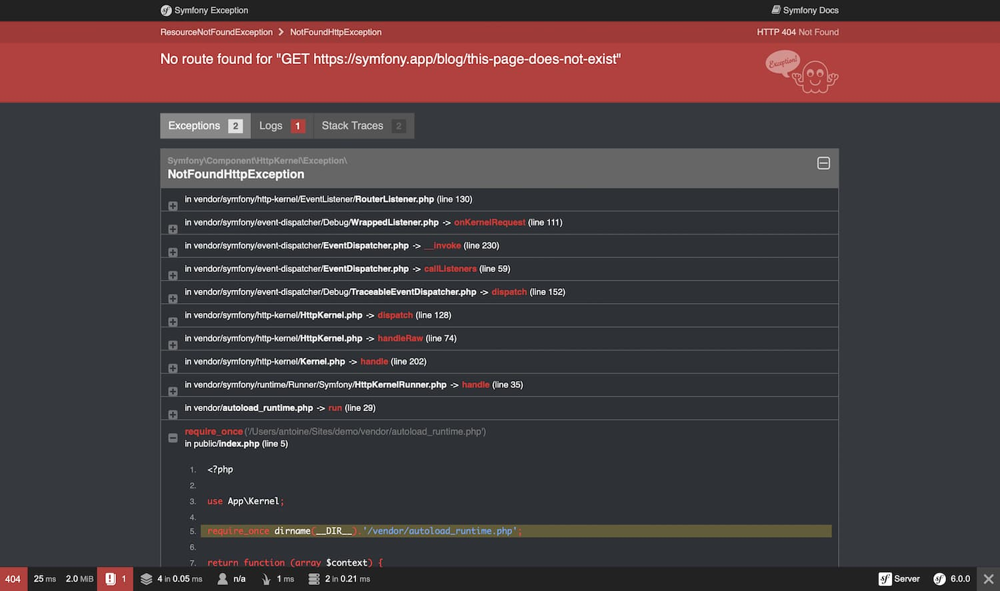

# Hata Sayfalarını Özelleştirme

Symfony uygulamalarında, tüm hatalar birer **exception (istisna)** olarak değerlendirilir. Bu, ister bir **404 Not Found (Bulunamadı)** hatası olsun, ister kodunuzda fırlatılan ciddi bir hata (fatal error) olsun fark etmez — Symfony bunların hepsini birer exception olarak ele alır.

Geliştirme ortamında ( **dev environment** ) Symfony, oluşan tüm exception’ları yakalar ve size hatanın kaynağını bulmanıza yardımcı olacak **ayrıntılı hata ayıklama (debug)** bilgilerini içeren özel bir hata sayfası gösterir.

Bu sayfa, hatanın türünü, mesajını, stack trace bilgisini ve hatta hatanın nerede oluştuğunu anlamanızı kolaylaştıracak şekilde hazırlanmıştır.





Bu sayfalar çok sayıda **hassas içsel bilgi** içerdiğinden, Symfony bunları **üretim ortamında (production environment)**  **göstermez** .

Bunun yerine, kullanıcıya yalnızca basit ve genel bir **hata sayfası** gösterilir:

> Bu sayfa, sistemin iç yapısını veya hata detaylarını gizleyerek güvenliği korumak amacıyla sadeleştirilmiştir.


# Üretim Ortamında Hata Sayfalarını Özelleştirme

Üretim ortamındaki hata sayfaları, ihtiyaçlarınıza göre farklı şekillerde özelleştirilebilir:

* **Yalnızca hata sayfalarının içeriğini ve stilini** , uygulamanızın genel görünümüne uygun hale getirmek istiyorsanız, **varsayılan hata şablonlarını (templates)** geçersiz kılabilirsiniz.
* **HTML dışı hata çıktılarının** (örneğin JSON, XML) içeriğini değiştirmek istiyorsanız, **yeni bir normalizer** oluşturabilirsiniz.
* Symfony’nin hata sayfalarını oluştururken kullandığı **mantığı (logic)** da değiştirmek istiyorsanız, **varsayılan hata denetleyicisini (error controller)** geçersiz kılabilirsiniz.
* Hata yakalama süreci üzerinde **tam kontrol** istiyorsanız, kendi mantığınızı çalıştırmak için **`kernel.exception` olayını** (event) dinleyebilirsiniz.

---

## Varsayılan Hata Şablonlarını Geçersiz Kılmak

Symfony, **Twig** kullanarak hata sayfalarını oluşturur. Bu nedenle, yerleşik **Twig hata render’ını (TwigErrorRenderer)** kullanarak varsayılan hata şablonlarını kolayca geçersiz kılabilirsiniz.

Bu işlem için hem **TwigBundle** hem de **TwigBridge** kurulu olmalıdır. Aşağıdaki komutu çalıştırarak her ikisinin de kurulu olduğundan emin olun:

```bash
composer require symfony/twig-pack
```

Hata sayfası yüklendiğinde, Symfony kullanıcıya gösterilecek Twig şablonunu oluşturmak için `TwigErrorRenderer` sınıfını kullanır.

Bu sınıf, kullanılacak şablon dosyasını belirlemek için HTTP durum koduna göre şu mantığı izler:

1. İlgili durum koduna özel bir şablon var mı diye bakar (örneğin `error500.html.twig`).
2. Eğer o dosya yoksa, durum kodunu göz ardı eder ve genel bir şablon arar (`error.html.twig`).

Bu şablonları geçersiz kılmak için, bir bundle içindeki şablonları geçersiz kılmanın standart Symfony yöntemini kullanın ve bunları şu dizine yerleştirin:

```
templates/bundles/TwigBundle/Exception/
```

---

### Tipik Bir HTML Projesi Dizini

HTML sayfaları döndüren tipik bir Symfony projesinde hata şablonları şu şekilde düzenlenebilir:

```
templates/
└─ bundles/
   └─ TwigBundle/
      └─ Exception/
         ├─ error404.html.twig
         ├─ error403.html.twig
         └─ error.html.twig      # Diğer tüm HTML hataları (500 dahil)
```

---

## 404 Hata Şablonu Örneği

HTML sayfaları için özel bir **404 Hata Sayfası** oluşturmak isterseniz, `templates/bundles/TwigBundle/Exception/` dizini altına `error404.html.twig` dosyasını ekleyin:

```twig
{# templates/bundles/TwigBundle/Exception/error404.html.twig #}



    <h1>Sayfa Bulunamadı</h1>

    <p>
        Aradığınız sayfa bulunamadı. Lütfen URL’nin doğru olduğundan emin olun
        veya <a href="{{ path('homepage') }}">ana sayfaya dönün</a>.
    </p>

```

---

## Twig Şablonuna Aktarılan Değişkenler

`TwigErrorRenderer`, hata şablonuna bazı yararlı değişkenler gönderir:

* `status_code` → HTTP durum kodunu içerir (örneğin 404 veya 500)
* `status_text` → Duruma ait kısa açıklamayı içerir (örneğin *Not Found* veya  *Internal Server Error* )

Ayrıca `exception` adlı Twig değişkeni aracılığıyla **`HttpException` nesnesine** erişebilirsiniz.

Örneğin, hata şu şekilde oluşturulmuşsa:

```php
throw $this->createNotFoundException('Ürün mevcut değil');
```

Bu mesajı Twig içinde şu şekilde gösterebilirsiniz:

```twig
<p>{{ exception.message }}</p>
```

Dilerseniz `{{ exception.traceAsString }}` ile **stack trace** bilgilerini de yazdırabilirsiniz, ancak bu bilgilerin **hassas veriler** içerdiğini unutmayın. Bu nedenle bunu son kullanıcıya göstermemelisiniz.

---

## Ek Not

PHP hataları da varsayılan olarak exception’a dönüştürülür. Bu sayede, `exception` değişkeni aracılığıyla bu hataların ayrıntılarına da erişebilirsiniz.

---


# Güvenlik ve 404 Sayfaları

Symfony’de **routing (yönlendirme)** ve **security (güvenlik)** sistemlerinin yüklenme sırası nedeniyle,  **404 hata sayfalarında güvenlik bilgilerine erişilemez** .

Bu, **kullanıcının 404 sayfasında çıkış yapmış gibi görünmesine** neden olur (geliştirme ortamında test ederken normal çalışır, ancak üretim ortamında bu bilgi mevcut değildir).

---

# Geliştirme Ortamında Hata Sayfalarını Test Etme

Geliştirme ortamında Symfony, her zamanki gibi özel hata sayfanızı değil, **ayrıntılı hata ayıklama (debug)** içeren büyük bir **exception sayfası** gösterir.

Peki, oluşturduğunuz özelleştirilmiş hata sayfasının nasıl göründüğünü test etmek isterseniz ne yapabilirsiniz?

Neyse ki, Symfony’nin **varsayılan ErrorController** sınıfı, geliştirme ortamında hata sayfalarını **önizlemenize (preview)** olanak tanır.

Bu özelliği kullanabilmek için, **FrameworkBundle** tarafından sağlanan özel rotaları yüklemeniz gerekir.

(Eğer projeniz Symfony Flex kullanıyorsa, `symfony/framework-bundle` kurulumunda bu rotalar otomatik olarak eklenir.)

```php
// config/routes/framework.php
use Symfony\Component\Routing\Loader\Configurator\RoutingConfigurator;

return function (RoutingConfigurator $routes): void {
    if ('dev' === $routes->env()) {
        $routes->import('@FrameworkBundle/Resources/config/routing/errors.php', 'php')
            ->prefix('/_error');
    }
};
```

Bu route eklendikten sonra, hata sayfalarınızı aşağıdaki adreslerden önizleyebilirsiniz (localhost’u kendi ortamınıza göre değiştirin):

* `http://localhost/_error/{statusCode}` → HTML hata sayfasını görüntüler.
* `http://localhost/_error/{statusCode}.{format}` → Belirli bir formatta (ör. JSON, XML) hata çıktısını görüntüler.

📘 **Not (Symfony 7.3 yeniliği):**

`errors.php` dosyası Symfony 7.3 sürümünde tanıtılmıştır.

Önceki sürümlerde bunun yerine `errors.xml` dosyası import edilmeliydi.

---

# HTML Dışı Formatlar için Hata Çıktısını Özelleştirme

HTML dışı (örneğin  **JSON** ,  **XML** , **CSV** veya  **YAML** ) hata çıktılarınızı özelleştirmek istiyorsanız, **Serializer bileşeninin** kurulu olması gerekir:

```bash
composer require symfony/serializer-pack
```

Serializer bileşeni, yerleşik olarak bir **FlattenException normalizer** (`ProblemNormalizer`) ve çeşitli encoder’lar (JSON/XML/CSV/YAML) içerir.

Uygulamanız bir exception fırlattığında, Symfony bu exception’ı bu formatlardan birinde çıktı olarak gösterebilir.

Bu çıktıyı özelleştirmek için `FlattenException` türünü destekleyen kendi **Normalizer** sınıfınızı yazabilirsiniz:

```php
# src/Serializer/MyCustomProblemNormalizer.php
namespace App\Serializer;

use Symfony\Component\ErrorHandler\Exception\FlattenException;
use Symfony\Component\Serializer\Normalizer\NormalizerInterface;

class MyCustomProblemNormalizer implements NormalizerInterface
{
    public function normalize($exception, ?string $format = null, array $context = []): array
    {
        return [
            'content' => 'Bu, özel bir problem normalizer örneğidir.',
            'exception'=> [
                'message' => $exception->getMessage(),
                'code' => $exception->getStatusCode(),
            ],
        ];
    }

    public function supportsNormalization($data, ?string $format = null, array $context = []): bool
    {
        return $data instanceof FlattenException;
    }
}
```

---

# Varsayılan ErrorController’ı Geçersiz Kılma

Yalnızca Twig şablonlarını değiştirmek yeterli gelmiyorsa ve daha fazla esneklik istiyorsanız, Symfony’nin hata sayfalarını oluşturan **controller’ı** değiştirebilirsiniz.

Bu sayede şablona **ek değişkenler** aktarabilir veya özel mantıklar uygulayabilirsiniz.

Yeni bir controller oluşturun ve `framework.error_controller` ayarını buna yönlendirin:

```php
// config/packages/framework.php
use Symfony\Config\FrameworkConfig;

return static function (FrameworkConfig $framework): void {
    // ...
    $framework->errorController('App\Controller\ErrorController::show');
};
```

Symfony’nin `FrameworkBundle` içinde bulunan `ErrorListener` sınıfı, **`kernel.exception`** olayını dinler ve exception yakalandığında isteği (request) bu controller’a yönlendirir.

Bu controller’a otomatik olarak iki parametre geçilir:

* **`exception`** → Yakalanan orijinal `Throwable` nesnesi.
* **`logger`** → `DebugLoggerInterface` türünde bir logger (bazı durumlarda `null` olabilir).

Bu şekilde tanımladığınız controller, **hata sayfası önizlemesinde de** (/_error/xxx rotalarıyla) kullanılabilir.

---

# `kernel.exception` Olayı ile Çalışmak

Bir exception fırlatıldığında, Symfony’nin `HttpKernel` sınıfı bu hatayı yakalar ve bir **`kernel.exception` olayı** yayınlar.

Bu, hatayı **farklı şekillerde bir `Response` nesnesine dönüştürmenize** olanak sağlar.

Bu yöntem, önceki örneklerden çok daha güçlüdür — ancak Symfony’nin iç yapısına daha derin bir hakimiyet gerektirir.

Diyelim ki, uygulamanızda özel anlamları olan **domain’e özgü exception’lar** fırlatıyorsunuz.

Bu durumda, `kernel.exception` olayını dinleyen kendi **event listener’ınızı** yazarak:

* Exception’ı inceleyebilir,
* Günlük (log) kaydı alabilir,
* Kullanıcıyı başka bir sayfaya yönlendirebilir
* veya özel hata sayfaları gösterebilirsiniz.

Eğer listener içinde `ExceptionEvent` nesnesinin `setResponse()` metodunu çağırırsanız, olayın yayılımı durdurulur ve bu yanıt doğrudan istemciye gönderilir.

Bu yaklaşım sayesinde hata yönetimini **merkezi ve katmanlı** hale getirebilirsiniz:

Aynı türdeki exception’ları her controller’da ayrı ayrı yakalamak yerine, bir veya birkaç listener bunları sistematik biçimde ele alabilir.

🔍 Gerçek bir örnek olarak Symfony’nin kendi `ExceptionListener` sınıfına bakabilirsiniz.

Bu listener, **güvenlikle ilgili exception’ları** (ör. `AccessDeniedException`) ele alır, kullanıcıyı giriş sayfasına yönlendirir, çıkış yaptırır veya uygun işlemleri gerçekleştirir.

---


# Hata Sayfalarını Statik HTML Dosyaları Olarak Dışa Aktarma

📘 **Yeni Özellik (Symfony 7.3)**

Hata sayfalarını statik HTML dosyalarına **dışa aktarma (dump etme)** özelliği Symfony 7.3 sürümüyle birlikte tanıtılmıştır.

---

## Neden Statik Hata Sayfaları?

Symfony uygulamanıza ulaşılmadan önce (örneğin framework yüklenmeden önce) bir hata meydana gelirse, **web sunucusu kendi varsayılan hata sayfalarını** gösterir.

Bu durumda, oluşturduğunuz özel Symfony hata sayfaları devreye giremez.

 **Statik HTML hata sayfaları oluşturmak** , kullanıcıların **her zaman sizin tanımladığınız özel sayfaları** görmesini sağlar.

Ayrıca bu yöntem, **performansı artırır** çünkü web sunucusu hata sayfasını doğrudan kendi üzerinden sunabilir — Symfony uygulamasına istek gönderilmez.

---

## Statik HTML Hata Sayfaları Oluşturma

Symfony, hata sayfalarını **statik HTML dosyalarına dönüştürmek** için özel bir komut sunar:

```bash
APP_ENV=prod php bin/console error:dump var/cache/prod/error_pages/
```

Bu komut, tüm hata kodlarına ait sayfaları oluşturur ve `var/cache/prod/error_pages/` dizinine kaydeder.

Yalnızca belirli hata kodları için sayfalar oluşturmak isterseniz, bunları argüman olarak belirtebilirsiniz:

```bash
APP_ENV=prod php bin/console error:dump var/cache/prod/error_pages/ 401 403 404 500
```

---

## Web Sunucusunu Statik Hata Sayfalarını Kullanacak Şekilde Ayarlama

Oluşturulan HTML dosyalarının kullanılabilmesi için web sunucunuzu bu dosyalara yönlendirmelisiniz.

Aşağıda **Nginx** için örnek bir yapılandırma bulunmaktadır:

```nginx
# /etc/nginx/conf.d/example.com.conf
server {
    # Mevcut sunucu yapılandırması
    # ...

    # Statik hata sayfalarını kullan
    error_page 400 /error_pages/400.html;
    error_page 401 /error_pages/401.html;
    # ...
    error_page 510 /error_pages/510.html;
    error_page 511 /error_pages/511.html;

    location ^~ /error_pages/ {
        root /path/to/your/symfony/var/cache/error_pages;
        internal; # doğrudan URL erişimini engeller
    }
}
```

Bu yapılandırmayla, sunucuda bir hata oluştuğunda (örneğin 404 veya 500), Symfony’ye ulaşmadan doğrudan `var/cache/prod/error_pages` dizinindeki statik HTML sayfalar sunulur.

---

## Lisans

Bu çalışma (örnek kodlar dahil), **Creative Commons BY-SA 3.0** lisansı altında paylaşılmıştır.

---
