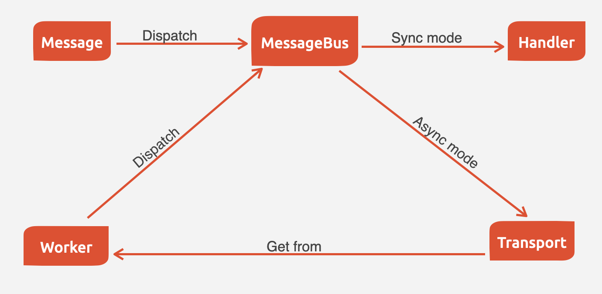
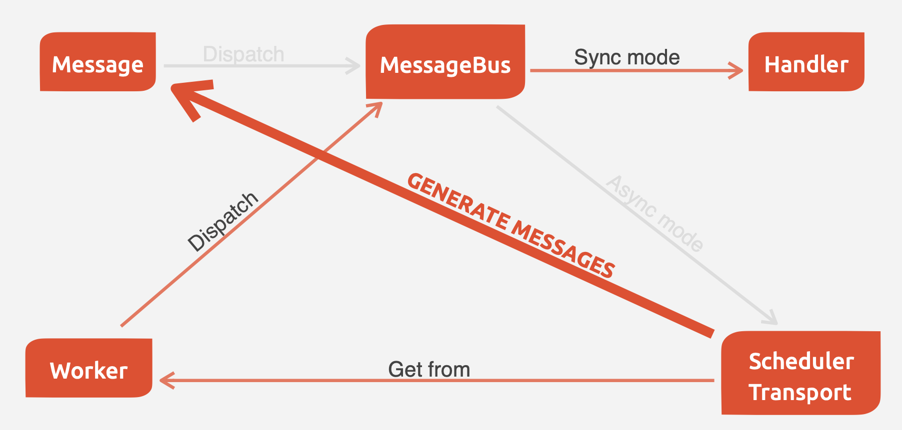

### 🕒 Zamanlayıcı (Scheduler)

Bu sayfayı düzenle

Video eğitimleri mi tercih ediyorsunuz? Scheduler hızlı başlangıç videosuna göz atın.

Scheduler bileşeni, PHP uygulamanızda görev zamanlamasını yönetir; örneğin, her gece saat 3’te, iki haftada bir (tatiller hariç) veya ihtiyaç duyduğunuz herhangi bir özel programda bir görevi çalıştırmak gibi.

Bu bileşen; bakım (veritabanı temizliği, önbellek temizleme vb.), arka plan işlemleri (kuyruk yönetimi, veri senkronizasyonu vb.), periyodik veri güncellemeleri, planlı bildirimler (e-posta, uyarı) ve benzeri görevlerin zamanlanması için kullanışlıdır.

Bu doküman, Scheduler bileşeninin tam yığın bir Symfony uygulaması bağlamında nasıl kullanılacağını açıklar.

---

### ⚙️ Kurulum

Scheduler bileşenini yüklemek için şu komutu çalıştırın:

```
composer require symfony/scheduler
```

Symfony Flex kullanan uygulamalarda, bu bileşenin kurulumu aynı zamanda görevlerinizi eklemeye hazır bir başlangıç zaman çizelgesi oluşturur.

---

### 🧩 Symfony Scheduler Temelleri

Bu bileşeni kullanmanın ana avantajı, otomasyonun uygulamanız tarafından yönetilmesidir. Bu da cron görevlerinde mümkün olmayan bir esneklik sağlar (örneğin, belirli koşullara göre dinamik zamanlamalar).

Temelinde, Scheduler bileşeni bir hizmet tarafından yürütülen ve belirli bir zaman çizelgesine göre tekrarlanan bir görev (mesaj olarak adlandırılır) oluşturmanıza olanak tanır.

Symfony Messenger bileşeniyle benzerlikleri vardır (örneğin: mesaj, işleyici, bus, taşıyıcı vb.), ancak en büyük fark, Messenger’ın düzenli aralıklarla tekrarlanan görevlerle ilgilenememesidir.

---

### 📊 Örnek: Günlük Rapor Gönderimi

Aşağıdaki örnekte, belirli aralıklarla müşterilere rapor gönderen bir uygulama ele alınmaktadır.

Önce, rapor oluşturma görevini temsil eden bir Scheduler mesajı oluşturun:

```php
// src/Scheduler/Message/SendDailySalesReports.php
namespace App\Scheduler\Message;

class SendDailySalesReports
{
    public function __construct(private int $id) {}

    public function getId(): int
    {
        return $this->id;
    }
}
```

Ardından, bu tür mesajları işleyen bir handler oluşturun:

```php
// src/Scheduler/Handler/SendDailySalesReportsHandler.php
namespace App\Scheduler\Handler;

use App\Scheduler\Message\SendDailySalesReports;
use Symfony\Component\Messenger\Attribute\AsMessageHandler;

#[AsMessageHandler]
class SendDailySalesReportsHandler
{
    public function __invoke(SendDailySalesReports $message)
    {
        // ... müşterilere raporu göndermek için gerekli işlemler yapılır
    }
}
```

Bu mesajları anında göndermek yerine (Messenger bileşeninde olduğu gibi), bunları önceden tanımlanmış bir sıklığa göre oluşturmak istiyoruz.

Bu, Scheduler mesajları için özel bir taşıyıcı olan **SchedulerTransport** sayesinde mümkündür.

Taşıyıcı, kendisine atanan sıklıklara göre çeşitli mesajları otomatik olarak üretir.

Aşağıdaki görseller, Messenger ve Scheduler bileşenlerinde mesajların işlenme farklarını göstermektedir:

**Messenger’da:**




In Scheduler:




### 🔁 Tekrarlayan Mesajlar

Bir diğer önemli fark, Scheduler bileşenindeki mesajların tekrarlayan (recurring) olmasıdır.

Bu mesajlar **RecurringMessage** sınıfı aracılığıyla temsil edilir.

---

### 🧷 Tekrarlayan Mesajları Bir Zaman Çizelgesine Eklemek

Mesaj sıklığının yapılandırması, **ScheduleProviderInterface** arabirimini uygulayan bir sınıfta saklanır.

Bu sağlayıcı, farklı tekrarlayan mesajları içeren bir zaman çizelgesini döndürmek için `getSchedule()` yöntemini kullanır.

Varsayılan olarak **default** adlı zaman çizelgesine referans veren **AsSchedule** attribute’u, belirli bir zaman çizelgesine kayıt olmanıza olanak tanır:

```php
// src/Scheduler/SaleTaskProvider.php
namespace App\Scheduler;

use Symfony\Component\Scheduler\Attribute\AsSchedule;
use Symfony\Component\Scheduler\Schedule;
use Symfony\Component\Scheduler\ScheduleProviderInterface;

#[AsSchedule]
class SaleTaskProvider implements ScheduleProviderInterface
{
    public function getSchedule(): Schedule
    {
        // ...
    }
}
```

Varsayılan olarak zaman çizelgesinin adı `default` olur ve taşıyıcı adı şu söz dizimini izler:

`scheduler_nameofyourschedule` (örneğin: `scheduler_default`).

`getSchedule()` yöntemi başka bir servis tarafından çağrıldığında gereksiz yeniden oluşturmayı önlemek için zaman çizelgesini **önbelleğe almak (memoize etmek)** iyi bir uygulamadır.

---

### 🗓️ Tekrarlayan Mesajları Zamanlamak

Bir  **RecurringMessage** , mesajla ilişkilendirilmiş bir **trigger** (tetikleyici) içerir.

Bu tetikleyici, mesajın sıklığını yapılandırır.

Symfony çeşitli tetikleyici türleri sağlar:

| Tetikleyici                     | Açıklama                                                                                    |
| ------------------------------- | --------------------------------------------------------------------------------------------- |
| **CronExpressionTrigger** | `cron`komut satırı aracının söz dizimini kullanır.                                    |
| **CallbackTrigger**       | Bir geri çağırma (callback) aracılığıyla bir sonraki çalıştırma tarihini belirler. |
| **ExcludeTimeTrigger**    | Belirli zamanları hariç tutar.                                                              |
| **JitterTrigger**         | Rastgele bir sapma (jitter) ekler, bu sayede görevlerin yükü dağıtılır.                |
| **PeriodicalTrigger**     | Bir `DateInterval`kullanarak tekrarlama sıklığını belirler.                            |

**JitterTrigger** ve **ExcludeTimeTrigger** dekoratör görevi görür ve sardıkları tetikleyicinin davranışını değiştirir.

Sardıkları tetikleyiciye ve dekoratörlere şu şekilde erişebilirsiniz:

```php
$trigger = new ExcludeTimeTrigger(new JitterTrigger(
    CronExpressionTrigger::fromSpec('#midnight', new MyMessage())
));

$trigger->inner();      // CronExpressionTrigger
$trigger->decorators(); // [ExcludeTimeTrigger, JitterTrigger]
```

Bu tetikleyicilerin çoğu, aşağıdaki örneklerde gösterildiği gibi **RecurringMessage** sınıfı aracılığıyla oluşturulabilir.

---

### ⏰ Cron Expression Tetikleyicileri

Cron tetikleyicilerini kullanmadan önce şu bağımlılığı yüklemeniz gerekir:

```
composer require dragonmantank/cron-expression
```

Ardından cron komut satırı söz dizimiyle tarih/saat tanımlayın:

```php
RecurringMessage::cron('* * * * *', new Message());

// isteğe bağlı olarak zaman dilimini de tanımlayabilirsiniz
RecurringMessage::cron('* * * * *', new Message(), new \DateTimeZone('Africa/Malabo'));
```

Cron ifadelerini oluşturma veya anlamada yardıma ihtiyacınız varsa [crontab.guru](https://crontab.guru/) sitesine göz atabilirsiniz.

Ayrıca yaygın cron ifadelerini temsil eden bazı özel değerler de kullanabilirsiniz:

| Değer             | Açıklama                                   | Cron          |
| ------------------ | -------------------------------------------- | ------------- |
| @yearly, @annually | Yılda bir kez, 1 Ocak’ta gece yarısı     | `0 0 1 1 *` |
| @monthly           | Ayda bir kez, ayın ilk günü gece yarısı | `0 0 1 * *` |
| @weekly            | Haftada bir kez, Pazar gece yarısı         | `0 0 * * 0` |
| @daily, @midnight  | Günde bir kez, gece yarısı                | `0 0 * * *` |
| @hourly            | Saatte bir kez, her saatin ilk dakikasında  | `0 * * * *` |

Örnek:

```php
RecurringMessage::cron('@daily', new Message());
```

Cron görevlerini tanımlamak için **AsCronTask** attribute’unu da kullanabilirsiniz.

---

### 🌀 Hashed Cron İfadeleri

Aynı zamanda birden çok tetikleyici çalışacak şekilde zamanlanmışsa (örneğin hepsi gece yarısı `0 0 * * *`), bu durum yoğun yük oluşturabilir.

Bunu önlemek için ifadelerde **#** karakterini kullanabilirsiniz.

Değerler rastgele oluşturulur, ancak mesajın içeriğine göre **tutarlıdır** (deterministik).

Örneğin `"my task"` adlı bir mesaj için `# # * * *` ifadesi, `"56 20 * * *"` (her gün 20:56’da) şeklinde çözümlenebilir.

Aralıklar da belirlenebilir:

`# #(0-7) * * *` → her gün gece yarısı ile sabah 7 arası rastgele bir saatte çalışır.

Sadece `#` kullanmak tüm geçerli değer aralığını temsil eder:

`# # # # #` kısaltması `#(0-59) #(0-23) #(1-28) #(1-12) #(0-6)` anlamına gelir.

Bazı özel hashed cron kısaltmaları da vardır:

| Takma Ad         | Cron Eşdeğeri    | Açıklama                                      |
| ---------------- | ------------------ | ----------------------------------------------- |
| #hourly          | `# * * * *`      | Her saat rastgele bir dakikada                  |
| #daily           | `# # * * *`      | Her gün rastgele bir saatte                    |
| #weekly          | `# # * * #`      | Her hafta rastgele bir zamanda                  |
| #weekly@midnight | `# #(0-2) * * #` | Haftada bir gece yarısı civarında            |
| #monthly         | `# # # * *`      | Ayda bir rastgele bir gün ve saatte            |
| #annually        | `# # # # *`      | Yılda bir rastgele bir gün ve saatte          |
| #midnight        | `# #(0-2) * * *` | Her gün gece yarısı ile 2:59 arası rastgele |

Örnek:

```php
RecurringMessage::cron('#midnight', new Message());
```

Not: Ay gün aralığı 1-28 olarak sınırlandırılmıştır (Şubat ayını da kapsamak için).

---

### ⏳ Periodical (Dönemsel) Tetikleyiciler

Bu tetikleyiciler, sıklığı tanımlamak için çeşitli veri türlerini (`string`, `integer`, `DateInterval`) destekler.

Ayrıca PHP `datetime` fonksiyonlarında tanımlanan göreceli biçimleri de kullanabilirsiniz:

```php
RecurringMessage::every('10 seconds', new Message());
RecurringMessage::every('3 weeks', new Message());
RecurringMessage::every('first Monday of next month', new Message());
```

Virgülle ayrılmış haftanın günleri (`'Monday, Thursday, Saturday'`) `every()` yöntemiyle desteklenmez.

Birden fazla gün için cron ifadeleri kullanın:

```diff
- RecurringMessage::every('Monday, Thursday, Saturday', new Message());
+ RecurringMessage::cron('5 12 * * 1,4,6', new Message());
```

Dönemsel görevleri tanımlamak için **AsPeriodicTask** attribute’unu da kullanabilirsiniz.

Ayrıca zaman çizelgeniz için **from** (başlangıç) ve **until** (bitiş) zamanları belirleyebilirsiniz:

```php
// Her gün 13:00'te bir mesaj oluştur
$from = new \DateTimeImmutable('13:00', new \DateTimeZone('Europe/Paris'));
RecurringMessage::every('1 day', new Message(), $from);

// Belirli bir tarihe kadar her gün bir mesaj oluştur
$until = '2023-06-12';
RecurringMessage::every('1 day', new Message(), null, $until);

// from ve until değerlerini birlikte kullan
$from = new \DateTimeImmutable('2023-01-01 13:47', new \DateTimeZone('Europe/Paris'));
$until = '2023-06-12';
RecurringMessage::every('first Monday of next month', new Message(), $from, $until);
```

Scheduler başlatıldığında mesaj hemen Messenger’a gönderilmez.

Eğer `from` parametresi ayarlanmazsa, ilk tekrarlama dönemi Scheduler’ın çalıştığı andan itibaren başlar.

Örneğin Scheduler’ı 08:33’te başlatır ve saatlik bir mesaj planlarsanız, mesaj 09:33, 10:33, 11:33 vb. saatlerde çalışacaktır.


### ⚙️ Özel Tetikleyiciler (Custom Triggers)

Özel tetikleyiciler, herhangi bir sıklığı dinamik olarak yapılandırmanıza olanak tanır.

Bunlar, **TriggerInterface** arabirimini uygulayan servisler olarak oluşturulur.

Örneğin, tatil dönemleri hariç her gün müşteri raporları göndermek isterseniz:

```php
// src/Scheduler/Trigger/NewUserWelcomeEmailHandler.php
namespace App\Scheduler\Trigger;

class ExcludeHolidaysTrigger implements TriggerInterface
{
    public function __construct(private TriggerInterface $inner)
    {
    }

    // tetikleyicinize kolay tanımlanabilir bir ad vermek için
    // (hata ayıklamayı kolaylaştırır)
    public function __toString(): string
    {
        return $this->inner.' (except holidays)';
    }

    public function getNextRunDate(\DateTimeImmutable $run): ?\DateTimeImmutable
    {
        if (!$nextRun = $this->inner->getNextRunDate($run)) {
            return null;
        }

        // tatil olmayan bir tarih bulana kadar döngüye gir
        while ($this->isHoliday($nextRun)) {
            $nextRun = $this->inner->getNextRunDate($nextRun);
        }

        return $nextRun;
    }

    private function isHoliday(\DateTimeImmutable $timestamp): bool
    {
        // verilen $timestamp’in tatil olup olmadığını belirleyecek mantığı ekle
        // tatilse true, değilse false döndür
    }
}
```

Ardından tekrarlayan mesajınızı tanımlayın:

```php
RecurringMessage::trigger(
    new ExcludeHolidaysTrigger(
        CronExpressionTrigger::fromSpec('@daily'),
    ),
    new SendDailySalesReports('...'),
);
```

Son olarak, bu tekrarlayan mesajların bir zaman çizelgesine eklenmesi gerekir:

```php
// src/Scheduler/SaleTaskProvider.php
namespace App\Scheduler;

#[AsSchedule('uptoyou')]
class SaleTaskProvider implements ScheduleProviderInterface
{
    public function getSchedule(): Schedule
    {
        return $this->schedule ??= (new Schedule())
            ->with(
                RecurringMessage::trigger(
                    new ExcludeHolidaysTrigger(
                        CronExpressionTrigger::fromSpec('@daily'),
                    ),
                    new SendDailySalesReports()
                ),
                RecurringMessage::cron('3 8 * * 1', new CleanUpOldSalesReport())
            );
    }
}
```

Bu şekilde, **RecurringMessage** hem mesajın üretim sıklığını tanımlayan tetikleyiciyi hem de işlenecek mesajı kapsar.

Ancak dikkat edilmesi gereken nokta, bu yapı size mesaj(lar)ınızı **dinamik olarak oluşturma** imkânı da sağlar.

---

### 🔄 Dinamik Mesaj Oluşturma Yaklaşımı

Bu özellik, mesajların veritabanlarında veya üçüncü taraf servislerde saklanan verilere bağlı olduğu durumlarda özellikle faydalıdır.

Önceki rapor oluşturma örneğinde olduğu gibi, raporlar müşteri taleplerine bağlı olabilir.

Bu durumda, belirli sıklıkta oluşturulması gereken rapor sayısı değişkenlik gösterebilir.

Bu tür dinamik senaryolar için mesaj(lar)ınızı statik değil  **dinamik olarak tanımlayabilirsiniz** .

Bu, bir **CallbackMessageProvider** tanımlayarak gerçekleştirilir.

Bu, çalışma zamanında (runtime), mesajlarınızı bir **callback** aracılığıyla dinamik olarak oluşturabileceğiniz anlamına gelir.

Bu callback, scheduler transport her mesaj üretimi kontrolünde çalıştırılır:

```php
// src/Scheduler/SaleTaskProvider.php
namespace App\Scheduler;

#[AsSchedule('uptoyou')]
class SaleTaskProvider implements ScheduleProviderInterface
{
    public function getSchedule(): Schedule
    {
        return $this->schedule ??= (new Schedule())
            ->with(
                RecurringMessage::trigger(
                    new ExcludeHolidaysTrigger(
                        CronExpressionTrigger::fromSpec('@daily'),
                    ),
                    // önceki örnekteki gibi statik değil
                    new CallbackMessageProvider([$this, 'generateReports'], 'foo')
                ),
                RecurringMessage::cron('3 8 * * 1', new CleanUpOldSalesReport())
            );
    }

    public function generateReports(MessageContext $context)
    {
        // ...
        yield new SendDailySalesReports();
        yield new ReportSomethingReportSomethingElse();
    }
}
```

---

### 🧠 Tekrarlayan Mesajlarınızı Oluşturmanın Alternatif Yolları

**RecurringMessage** oluşturmanın bir diğer yolu da bir servise veya komuta aşağıdaki attribute’lardan birini eklemektir:

**AsPeriodicTask** ve **AsCronTask**

Her iki attribute için de kullanılacak zaman çizelgesini `schedule` seçeneğiyle tanımlayabilirsiniz.

Varsayılan olarak **default** adlı zaman çizelgesi kullanılır.

Ayrıca varsayılan olarak servisinizin `__invoke()` metodu çağrılır, ancak `method` seçeneğiyle farklı bir metot çağırabilir ve `arguments` seçeneğiyle parametreler tanımlayabilirsiniz.

---

### 🕓 AsCronTask Örneği

Bu attribute ile bir cron tetikleyicisi tanımlamanın en basit yolu:

```php
// src/Scheduler/Task/SendDailySalesReports.php
namespace App\Scheduler\Task;

use Symfony\Component\Scheduler\Attribute\AsCronTask;

#[AsCronTask('0 0 * * *')]
class SendDailySalesReports
{
    public function __invoke()
    {
        // ...
    }
}
```

Attribute, tetikleyiciyi özelleştirmek için ek parametreler de alabilir:

```php
// yük artışlarını önlemek için tetikleme süresine rastgele 6 saniyeye kadar ekleme yapar
#[AsCronTask('0 0 * * *', jitter: 6)]

// çağrılacak metodu ve ona iletilecek argümanları tanımlar
#[AsCronTask('0 0 * * *', method: 'sendEmail', arguments: ['email' => 'admin@example.com'])]

// kullanılacak zaman dilimini tanımlar
#[AsCronTask('0 0 * * *', timezone: 'Africa/Malabo')]

// Symfony konsol komutlarına uygulandığında, 'arguments' seçeneğiyle komuta argümanlar geçebilirsiniz
#[AsCronTask('0 0 * * *', arguments: 'some_argument --some-option --another-option=some_value')]
#[AsCommand(name: 'app:my-command')]
class MyCommand
```

---

### ⏱️ AsPeriodicTask Örneği

Bu attribute ile bir periodik tetikleyici tanımlamanın en basit yolu:

```php
// src/Scheduler/Task/SendDailySalesReports.php
namespace App\Scheduler\Task;

use Symfony\Component\Scheduler\Attribute\AsPeriodicTask;

#[AsPeriodicTask(frequency: '1 day', from: '2022-01-01', until: '2023-06-12')]
class SendDailySalesReports
{
    public function __invoke()
    {
        // ...
    }
}
```

`from` ve `until` seçenekleri isteğe bağlıdır.

Tanımlanmazsa görev süresiz olarak çalıştırılır.

`#[AsPeriodicTask]` attribute’u, tetikleyiciyi özelleştirmek için birçok parametre alabilir:

```php
// frekans saniye cinsinden tamsayı olarak tanımlanabilir
#[AsPeriodicTask(frequency: 86400)]

// yük artışlarını önlemek için rastgele 6 saniyeye kadar gecikme ekler
#[AsPeriodicTask(frequency: '1 day', jitter: 6)]

// çağrılacak metodu ve argümanlarını tanımlar
#[AsPeriodicTask(frequency: '1 day', method: 'sendEmail', arguments: ['email' => 'admin@symfony.com'])]
class SendDailySalesReports
{
    public function sendEmail(string $email): void
    {
        // ...
    }
}

// Symfony konsol komutlarında argüman ve seçenekler tanımlanabilir
#[AsPeriodicTask(frequency: '1 day', arguments: 'some_argument --some-option --another-option=some_value')]
#[AsCommand(name: 'app:my-command')]
class MyCommand
```


### 🗂️ Zamanlanmış Mesajların Yönetimi

---

### 🔧 Gerçek Zamanlı Olarak Zamanlanmış Mesajları Değiştirme

Zaman çizelgesini önceden planlamak faydalıdır, ancak çizelgelerin zaman içinde sabit kalması nadirdir.

Belirli bir süre sonra bazı  **RecurringMessage** ’lar geçerliliğini yitirebilir, bazılarıysa plana eklenmesi gerekebilir.

Genel bir uygulama olarak, yoğun iş yükünü hafifletmek için çizelgedeki tekrarlayan mesajlar bellekte saklanır.

Bu, Scheduler transport her mesaj oluşturduğunda yeniden hesaplama yapılmasını önler.

Ancak bu yaklaşımın bazı dezavantajları da olabilir.

Örneğin rapor oluşturma örneğinde olduğu gibi, şirket belirli dönemlerde promosyonlar yapabilir (ve bu promosyonların belirli bir süre boyunca tekrarlanarak iletilmesi gerekir) veya eski raporların silinmesi belirli koşullarda durdurulabilir.

İşte bu nedenle  **Scheduler** , zaman çizelgesini **dinamik olarak değiştirme** ve tüm değişiklikleri **gerçek zamanlı olarak işleme** mekanizmasını içerir.

---

### ➕➖ Zaman Çizelgesi Üzerinde Girdi Ekleme, Kaldırma ve Değiştirme Stratejileri

Zaman çizelgesi; ilişkili tekrarlayan mesajları eklemek (`add()`), kaldırmak (`remove()`) veya tümünü temizlemek (`clear()`) için olanak sağlar.

Bu işlemler, bellekte tutulan tekrarlayan mesaj yığınını sıfırlar ve yeniden hesaplama başlatır.

Örneğin, belirli nedenlerle rapor oluşturulmasına gerek yoksa, bir **callback** kullanarak bazı raporların oluşturulmasını koşullu olarak atlayabilirsiniz.

Ancak bir tekrarlayan mesajı ve onun tekrar sıklığını tamamen kaldırmak isterseniz, **Schedule** sınıfındaki `remove()` veya `removeById()` yöntemlerini kullanabilirsiniz.

Bu, özellikle eski raporların silinmesini durdurmak istediğiniz durumlarda yararlı olur.

Aşağıdaki örnekte, handler içinde bir koşul kontrol edilip, doğruysa Schedule erişilerek bu yöntem çağrılır:

```php
// src/Scheduler/SaleTaskProvider.php
namespace App\Scheduler;

#[AsSchedule('uptoyou')]
class SaleTaskProvider implements ScheduleProviderInterface
{
    public function getSchedule(): Schedule
    {
        $this->removeOldReports = RecurringMessage::cron('3 8 * * 1', new CleanUpOldSalesReport());

        return $this->schedule ??= (new Schedule())
            ->with(
                // ...
                $this->removeOldReports;
            );
    }

    // ...

    public function removeCleanUpMessage()
    {
        $this->getSchedule()->getSchedule()->remove($this->removeOldReports);
    }
}

// src/Scheduler/Handler/CleanUpOldSalesReportHandler.php
namespace App\Scheduler\Handler;

#[AsMessageHandler]
class CleanUpOldSalesReportHandler
{
    public function __invoke(CleanUpOldSalesReport $cleanUpOldSalesReport): void
    {
        // gerekli işlemler yapılır...

        if ($isFinished) {
            $this->mySchedule->removeCleanUpMessage();
        }
    }
}
```

Yine de bu sistem her senaryo için uygun olmayabilir.

Bir handler, esas olarak işlenecek mesaj türüne odaklanmalı; yeni bir tekrarlayan mesaj ekleme veya kaldırma kararlarını vermemelidir.

Örneğin, harici bir olay sonucunda raporları silmeye yönelik yeni bir tekrarlayan mesaj eklenmesi gerekirse, bunu handler içinde yapmak zor olabilir.

Çünkü artık o türde mesaj kalmadığında handler tetiklenmez.

---

### 🧩 Olaylar Üzerinden Zamanlanmış Mesaj Yönetimi

Symfony tam yığın uygulamalarda  **Scheduler** , **Messenger olayları** ile entegre olan bir olay sistemi içerir.

Bu olaylar, bir listener aracılığıyla tetiklenir ve müdahale etmenizi kolaylaştırır.

---

### 🎯 Stratejik Olay Yönetimi

Amaç, bağımsızlığı korurken aksiyon alınacak zamanı esnek bir şekilde belirlemektir.

Üç ana olay türü tanıtılmıştır:

* **PRE_RUN_EVENT**
* **POST_RUN_EVENT**
* **FAILURE_EVENT**

Bu olaylar, hem zaman çizelgesine erişim hem de o anda işlenen mesaj ve mesaj bağlamına (MessageContext) erişim olanağı sağlar.

Örneğin, **PRE_RUN_EVENT** dinlenerek belirli bir koşul kontrol edilebilir.

Bu koşul sağlanırsa eski raporları silmek için yeni bir tekrarlayan mesaj ekleyebilir veya mevcut olanı yeniden tanımlayabilirsiniz.

Eğer tekrarlayan bir mesajın silinmesini bu olay aracılığıyla yönetmek isterseniz, **shouldCancel()** özelliğini kullanarak mesajın handler’a aktarılmasını engelleyebilirsiniz:

```php
// src/Scheduler/SaleTaskProvider.php
namespace App\Scheduler;

#[AsSchedule('uptoyou')]
class SaleTaskProvider implements ScheduleProviderInterface
{
    public function __construct(private EventDispatcherInterface $dispatcher)
    {
    }

    public function getSchedule(): Schedule
    {
        $this->removeOldReports = RecurringMessage::cron('3 8 * * 1', new CleanUpOldSalesReport());

        return $this->schedule ??= (new Schedule($this->dispatcher))
            ->with(
                // ...
            )
            ->before(function(PreRunEvent $event) {
                $message = $event->getMessage();
                $messageContext = $event->getMessageContext();

                // zaman çizelgesine erişim
                $schedule = $event->getSchedule()->getSchedule();

                // işlenmekte olan RecurringMessage’a doğrudan erişim
                $schedule->removeById($messageContext->id);

                // mesajın handler tarafından işlenmesini iptal et
                $event->shouldCancel(true);
            })
            ->after(function(PostRunEvent $event) {
                // işlem sonrası yapılacaklar
            })
            ->onFailure(function(FailureEvent $event) {
                // hata durumunda yapılacaklar
            });
    }
}
```

---

### 🧭 Scheduler Olayları

#### 🕓 PreRunEvent

**Sınıf:** `PreRunEvent`

Bir mesaj işlenmeden önce  **Schedule** ’ı değiştirmeye veya mesajı iptal etmeye olanak tanır:

```php
use Symfony\Component\EventDispatcher\EventSubscriberInterface;
use Symfony\Component\Scheduler\Event\PreRunEvent;

public function onMessage(PreRunEvent $event): void
{
    $schedule = $event->getSchedule();
    $context = $event->getMessageContext();
    $message = $event->getMessage();

    // schedule, context veya message üzerinde işlem yap
    // ve/veya mesajı iptal et
    $event->shouldCancel(true);
}
```

Bu komutla olaya kayıtlı listener’ları ve önceliklerini görebilirsiniz:

```
php bin/console debug:event-dispatcher "Symfony\Component\Scheduler\Event\PreRunEvent"
```

---

#### ✅ PostRunEvent

**Sınıf:** `PostRunEvent`

Bir mesaj işlendiğinde (tüketildikten sonra) **Schedule** üzerinde değişiklik yapmaya izin verir:

```php
use Symfony\Component\EventDispatcher\EventSubscriberInterface;
use Symfony\Component\Scheduler\Event\PostRunEvent;

public function onMessage(PostRunEvent $event): void
{
    $schedule = $event->getSchedule();
    $context = $event->getMessageContext();
    $message = $event->getMessage();
    $result = $event->getResult();

    // schedule, context, message veya result üzerinde işlem yap
}
```

> 🆕 `getResult()` metodu Symfony **7.3** sürümünde eklenmiştir.

Bu komutla listener’ları kontrol edin:

```
php bin/console debug:event-dispatcher "Symfony\Component\Scheduler\Event\PostRunEvent"
```

---

#### ❌ FailureEvent

**Sınıf:** `FailureEvent`

Bir mesajın işlenmesi sırasında bir istisna oluştuğunda  **Schedule** ’ı değiştirmeye olanak tanır:

```php
use Symfony\Component\EventDispatcher\EventSubscriberInterface;
use Symfony\Component\Scheduler\Event\FailureEvent;

public function onMessage(FailureEvent $event): void
{
    $schedule = $event->getSchedule();
    $context = $event->getMessageContext();
    $message = $event->getMessage();

    $error = $event->getError();

    // schedule, context, message veya error üzerinde işlem yap (örneğin loglama)

    // hata olayını yok say
    $event->shouldIgnore(true);
}
```

Listener’ları görüntülemek için:

```
php bin/console debug:event-dispatcher "Symfony\Component\Scheduler\Event\FailureEvent"
```


### ⚙️ Mesajların Tüketilmesi (Consuming Messages)

**Scheduler** bileşeni, ihtiyaçlarınıza bağlı olarak mesajları tüketmenin iki yolunu sunar:

1. `messenger:consume` komutunu kullanmak
2. Programatik olarak bir **worker** (işçi) oluşturmak

İlk yöntem, Scheduler bileşenini **tam yığın bir Symfony uygulaması** bağlamında kullanırken önerilen yoldur.

İkinci yöntem ise Scheduler bileşenini **bağımsız (standalone)** bir bileşen olarak kullandığınızda daha uygundur.

---

### 🧵 Bir Worker Çalıştırmak

Tekrarlayan mesajlarınızı tanımlayıp bir zaman çizelgesine ekledikten sonra, bu mesajların tanımlanan sıklıklara göre **oluşturulması ve tüketilmesi** için bir mekanizmaya ihtiyacınız olacaktır.

Bunu yapmak için Scheduler bileşeni, **Messenger** bileşeninin `messenger:consume` komutunu kullanır:


```
$ php bin/console messenger:consume scheduler_nameofyourschedule
```

Eğer neler olduğunu detaylı görmek isterseniz -vv parametresini kullanın

```
$ php bin/console messenger:consume scheduler_nameofyourschedule -vv
```


### ⚙️ Mesajların Tüketilmesi

**Scheduler** bileşeni, mesajları tüketmek için iki farklı yöntem sunar:

1. `messenger:consume` komutunu kullanmak
2. Programatik olarak bir **worker** oluşturmak

İlk yöntem, **tam yığın Symfony uygulamaları** için önerilir.

İkinci yöntem ise Scheduler bileşenini **bağımsız (standalone)** bir bileşen olarak kullanan projeler için uygundur.

---

### 🧭 Worker Sürecini Otomatikleştirmek

Dağıtım (deployment) senaryonuza bağlı olarak, **Messenger worker** sürecinin yürütülmesini otomatikleştirmek için şu araçlardan birini kullanabilirsiniz:

* **cron**
* **Supervisor**
* **systemd**

Bu araçlar, worker’ların sürekli çalışır durumda olmasını sağlar.

Daha fazla bilgi için, Messenger bileşeninin belgelerindeki **Deploying to Production** bölümüne bakabilirsiniz.

---

### 💻 Programatik Olarak Bir Consumer (Worker) Oluşturmak

Alternatif olarak, mesajları tüketmek için kod içinde bir worker oluşturabilirsiniz.

Bileşen, kullanıma hazır bir **Scheduler** sınıfı ile gelir:

```php
use Symfony\Component\Scheduler\Scheduler;

$schedule = (new Schedule())
    ->with(
        RecurringMessage::trigger(
            new ExcludeHolidaysTrigger(
                CronExpressionTrigger::fromSpec('@daily'),
            ),
            new SendDailySalesReports()
        ),
    );

$scheduler = new Scheduler(handlers: [
    SendDailySalesReports::class => new SendDailySalesReportsHandler(),
    // farklı mesaj türleriniz varsa daha fazla handler ekleyin
], schedules: [
    $schedule,
    // birden fazla zaman çizelgesi eklenebilir
]);

// scheduler hazır olduğunda çalıştırın
$scheduler->run();
```

> 💡 Bu yöntem, Scheduler bileşenini bağımsız bir şekilde kullandığınızda uygundur.
>
> Symfony framework bağlamında ise, bir önceki bölümde açıklandığı gibi `messenger:consume` komutunu kullanmanız  **şiddetle önerilir** .

---

### 🔄 Çalışma Zamanında (Runtime) Zaman Çizelgesini Değiştirme

Bir tekrarlayan mesaj zaman çizelgesine eklendiğinde veya kaldırıldığında, Scheduler otomatik olarak yeniden başlatılır ve dahili tetikleyici yığınını yeniden hesaplar.

Bu, çalışma zamanında zamanlanmış görevleri dinamik olarak kontrol etmenizi sağlar:

```php
// src/Scheduler/DynamicScheduleProvider.php
namespace App\Scheduler;

#[AsSchedule('uptoyou')]
class DynamicScheduleProvider implements ScheduleProviderInterface
{
    private ?Schedule $schedule = null;

    public function getSchedule(): Schedule
    {
        return $this->schedule ??= (new Schedule())
            ->with(
                // ...
            );
    }

    public function clearAndAddMessages(): void
    {
        // mevcut zaman çizelgesini temizle ve yeni mesajları ekle
        $this->schedule?->clear();
        $this->schedule?->add(
            RecurringMessage::cron('@hourly', new DoActionMessage()),
            RecurringMessage::cron('@daily', new DoAnotherActionMessage()),
        );
    }
}
```

---

### 🧩 Zaman Çizelgesini Hata Ayıklama

Zaman çizelgelerini ve bunlara bağlı tekrarlayan mesajları görüntülemek için `debug:scheduler` komutunu kullanabilirsiniz:

```
php bin/console debug:scheduler
```

**Örnek çıktı:**

```
Scheduler
=========

default
-------

  ------------------- ------------------------- ----------------------
  Trigger             Provider                  Next Run
  ------------------- ------------------------- ----------------------
  every 2 days        App\Messenger\Foo(0:17..)  Sun, 03 Dec 2023 ...
  15 4 */3 * *        App\Messenger\Foo(0:17..)  Mon, 18 Dec 2023 ...
  ------------------- ------------------------- ----------------------
```

Belirli bir tarih veya çizelgeyi filtrelemek için:

```
php bin/console debug:scheduler --date=2025-10-18
php bin/console debug:scheduler name_of_schedule --date=2025-10-18
php bin/console debug:scheduler --all
```

---

### ⚡ Symfony Scheduler ile Verimli Yönetim

Bir worker durdurulduğunda veya yeniden başlatıldığında, Scheduler transport mesaj oluşturamaz (çünkü mesajlar anlık olarak üretilir).

Bu, worker’ın aktif olmadığı süre boyunca planlanan mesajların **gönderilmeyeceği** anlamına gelir.

Scheduler, yeniden başlatıldığında son işlenen mesajı unutur ve o andan itibaren yeni mesajları üretir.

Örneğin:

Bir mesaj her 3 günde bir gönderilecek şekilde ayarlanmışsa ve worker 2. günde yeniden başlatılırsa, mesaj bir sonraki 3. gün yani 5. günde gönderilecektir.

Bu davranış her zaman istenen olmayabilir.

Bu yüzden Scheduler, **stateful** seçeneğiyle (ve **Cache** bileşeni aracılığıyla) bir mesajın son çalıştırılma tarihini hatırlayabilir:

```php
// src/Scheduler/SaleTaskProvider.php
namespace App\Scheduler;

#[AsSchedule('uptoyou')]
class SaleTaskProvider implements ScheduleProviderInterface
{
    public function getSchedule(): Schedule
    {
        $this->removeOldReports = RecurringMessage::cron('3 8 * * 1', new CleanUpOldSalesReport());

        return $this->schedule ??= (new Schedule())
            ->with(
                // ...
            )
            ->stateful($this->cache);
    }
}
```

`stateful` seçeneği etkinleştirildiğinde, kaçırılmış tüm mesajlar işlenir.

Ancak yalnızca **son kaçırılan mesajın** işlenmesini istiyorsanız, `processOnlyLastMissedRun` seçeneğini kullanabilirsiniz:

```php
// src/Scheduler/SaleTaskProvider.php
namespace App\Scheduler;

#[AsSchedule('uptoyou')]
class SaleTaskProvider implements ScheduleProviderInterface
{
    public function getSchedule(): Schedule
    {
        $this->removeOldReports = RecurringMessage::cron('3 8 * * 1', new CleanUpOldSalesReport());

        return $this->schedule ??= (new Schedule())
            ->with(
                // ...
            )
            ->stateful($this->cache)
            ->processOnlyLastMissedRun(true);
    }
}
```

> 🆕 `processOnlyLastMissedRun` seçeneği Symfony **7.2** sürümünde eklenmiştir.

---

### 🔒 Çoklu Worker ve Kilitleme (Lock) Desteği

Zaman çizelgelerinizi daha verimli ölçeklendirmek için birden fazla worker kullanabilirsiniz.

Bu durumda, aynı görevin birden fazla kez çalıştırılmasını önlemek için bir **lock (kilit)** eklemek iyi bir uygulamadır:

```php
// src/Scheduler/SaleTaskProvider.php
namespace App\Scheduler;

#[AsSchedule('uptoyou')]
class SaleTaskProvider implements ScheduleProviderInterface
{
    public function getSchedule(): Schedule
    {
        $this->removeOldReports = RecurringMessage::cron('3 8 * * 1', new CleanUpOldSalesReport());

        return $this->schedule ??= (new Schedule())
            ->with(
                // ...
            )
            ->lock($this->lockFactory->createLock('my-lock'));
    }
}
```

---

### 🕐 Mesaj İşleme Süresi ve RedispatchMessage

Bir mesajın işlenme süresi önemlidir.

Eğer bu süre uzunsa, sonraki mesajların işlenmesi gecikebilir.

Bu yüzden, mesaj sıklığını bu süreyi dikkate alarak planlamak gerekir.

Zaman çizelgelerini ölçeklendirmek için ayrıca **RedispatchMessage** kullanabilirsiniz.

Bu sayede, mesajınızı bir handler’a iletilmeden önce belirli bir taşıyıcıya (transport) yeniden yönlendirebilirsiniz:

```php
// src/Scheduler/SaleTaskProvider.php
namespace App\Scheduler;

#[AsSchedule('uptoyou')]
class SaleTaskProvider implements ScheduleProviderInterface
{
    public function getSchedule(): Schedule
    {
        return $this->schedule ??= (new Schedule())
            ->with(
                RecurringMessage::every('5 seconds', new RedispatchMessage(new Message(), 'async'))
            );
    }
}
```

**RedispatchMessage** kullanıldığında Symfony, mesaja bir **ScheduledStamp** ekler.

Bu, gerektiğinde bu mesajların kolayca tanımlanmasını sağlar.


